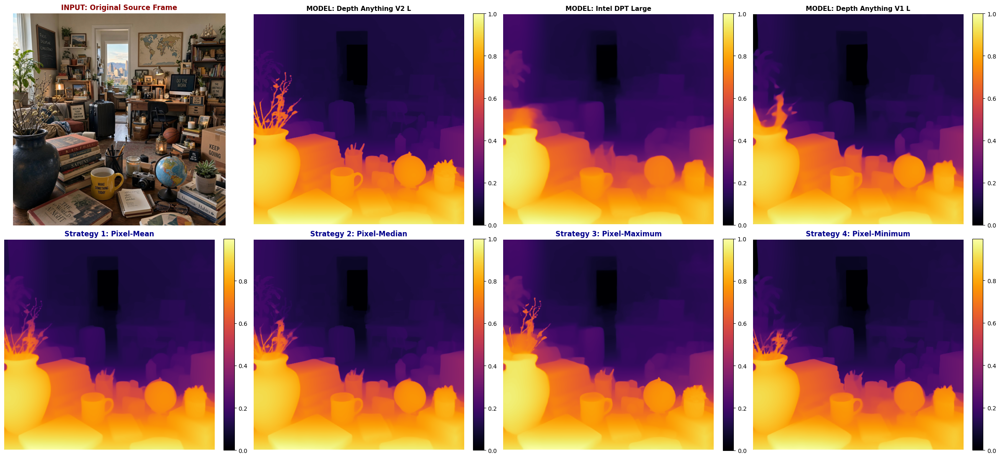
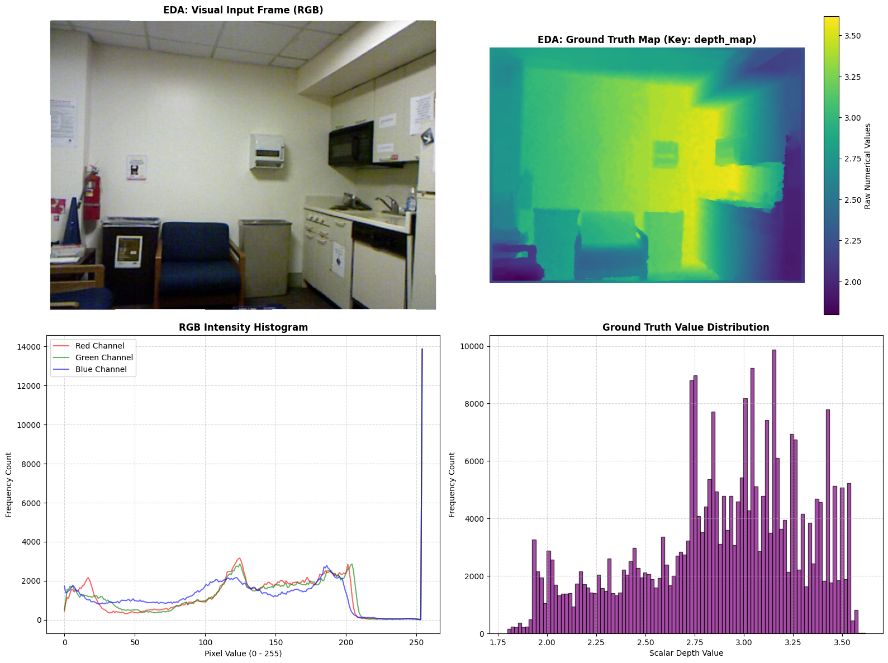
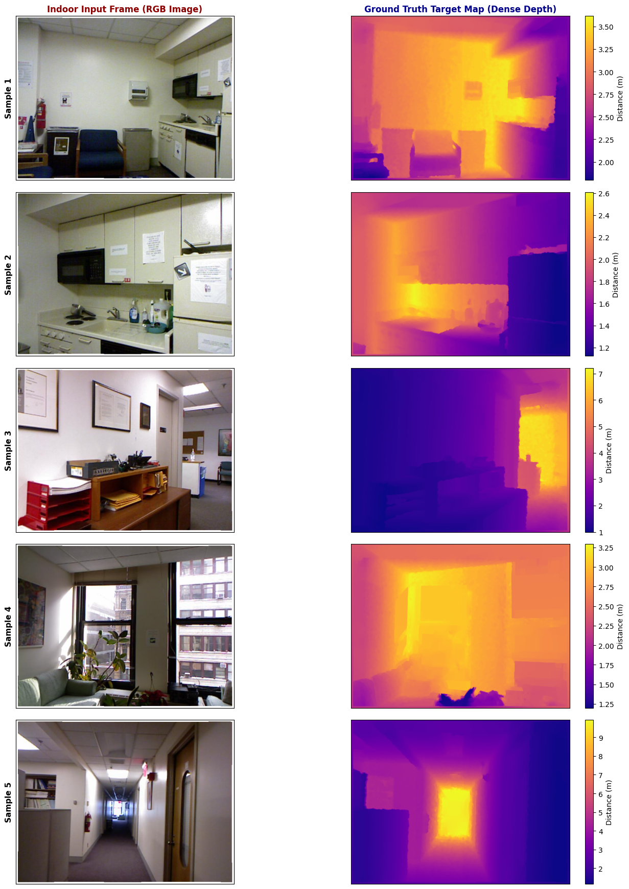
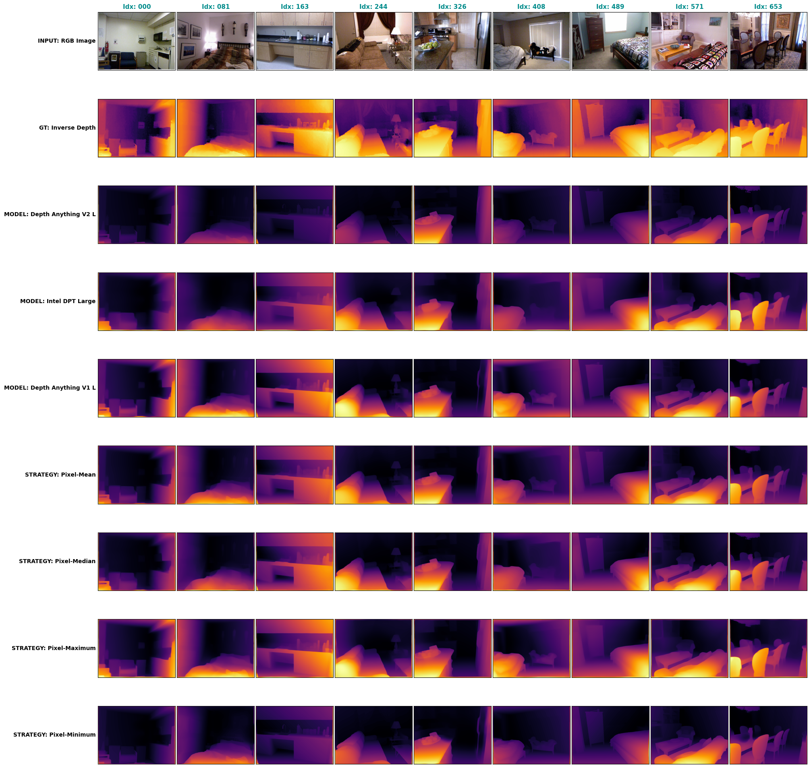
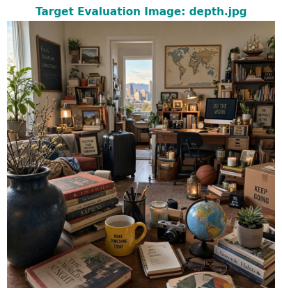
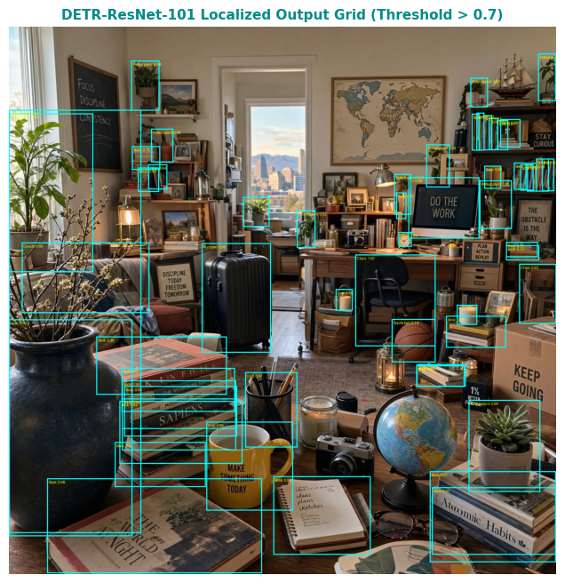
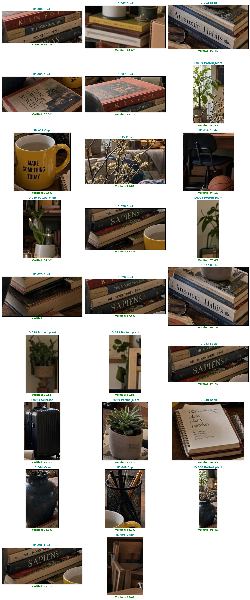
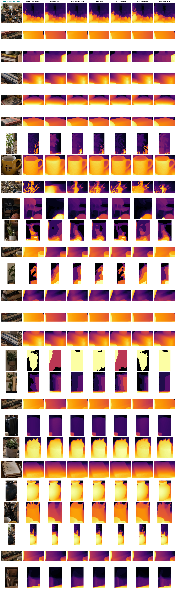

# Depth Estimation

<div style="background: linear-gradient(135deg, #f8fafc 0%, #f0fdfa 50%, #e0f2fe 100%); border-left: 6px solid #2563eb; border-radius: 8px; padding: 22px; margin: 24px 0; width: 100%; display: inline-block; box-sizing: border-box;">
    <p style="margin: 0 0 10px 0; font-size: 16px; font-family: 'Segoe UI', system-ui, sans-serif;">
        <span style="color: #1e40af; font-weight: 500;">Author:</span> 
        <strong style="color: #1d4ed8; font-size: 18px;">Dimo Dimov</strong>
    </p>
    <p style="margin: 0; font-size: 15px; font-family: 'Segoe UI', system-ui, sans-serif;">
        <span style="color: #1e40af; font-weight: 500;">Course:</span> Deep Learning 2026 @ <strong style="color: #1d4ed8;">SoftUni</strong>
    </p>
</div>

## Abstract

This project builds a complete, training-free monocular (single-image) depth
estimation system. Using three modern deep-learning models Depth Anything V1
and V2 and Intel DPT it predicts how far away everything in a photo is. The
notebook compares the individual models, combines their outputs with simple
fusion strategies (mean, median, maximum, minimum), and measures accuracy
against the NYU Depth V2 dataset of 654 validation images. It also finds objects
with the DETR detector, double-checks them with a cascade filter, profiles scene
difficulty with the CLIP vision-language model, and wraps everything in an
interactive web app. The overall goal is to show how an ensemble of models can
be more reliable than any single model, and to make the results easy to inspect.

**Keywords**

Monocular Depth Estimation, Ensemble Learning, Depth Anything, DPT, DETR, CLIP,
NYU Depth V2, Computer Vision, Hugging Face Transformers, Gradio.

## 0. Project Prerequisites & Specifications

1. depth.jpg: The reference input image named **depth.jpg must be uploaded** and located within the exact same root directory as the notebook file (Depth_Estimation.ipynb).
2. Hardware: This project is developed and highly optimized for an **NVIDIA T4 GPU** runtime environment with 12.7 GB of System RAM, 15.0 GB of GPU VRAM, and 112.6 GB of ROM.
3. Latency: Allow the progress tracking bars to finish completely without interrupting the active notebook kernel.
4. CLIP: Section "10. Zero-Shot Scene Profiling & Difficulty Index" utilizes an explicit "Object Proximity Scale" text-prompt bank. This framework helps the **CLIP vision-language model measure object depth alignment**.


## 1. Global Imports

This cell loads all the Python libraries the project needs. It brings in standard
tools for math (NumPy), data tables (pandas), and plotting (matplotlib), plus the
machine-learning frameworks (PyTorch and Hugging Face Transformers) and the
pre-trained models used later: the depth estimators, the DETR object detector,
and the CLIP vision-language model. It also imports Gradio for the final
interactive app. No computation happens here this just makes sure every
function is available before we use it.


```python
# ============================================================
# GLOBAL IMPORTS
# ============================================================
import os
import sys
import types
import csv
import time
import gc
import logging
import shutil
import zipfile

import cv2
import numpy as np
import pandas as pd
import matplotlib.cm as cm
import matplotlib.pyplot as plt
import gradio as gr
import torch

from PIL import Image, ImageDraw, ImageFont
from tqdm import tqdm
from datasets import load_dataset
from transformers import (
    AutoImageProcessor,
    AutoModelForDepthEstimation,
    AutoProcessor,
    CLIPModel,
    DetrImageProcessor,
    DetrForObjectDetection,
)
```

## 2. Global Configuration & Shared Constants

Here we set up the "settings" for the whole project in one place. This includes
which device to use (a GPU if available, otherwise the CPU), the exact names of
the models to download from Hugging Face, the confidence thresholds for object
detection, the folder paths used to save results, and the text prompts CLIP will
use to describe scenes. Keeping all of this at the top makes the notebook easy
to read and easy to adjust without hunting through the code.


```python
# ============================================================
# GLOBAL CONFIGURATION & SHARED CONSTANTS
# ============================================================
# --- Target runtime environment hardware setup ---
DEVICE = torch.device("cuda" if torch.cuda.is_available() else "cpu")

# --- Numerical stability and interpolation defaults ---
DEFAULT_EPSILON = 1e-8
INTERPOLATION_BILINEAR = "bilinear"
INTERPOLATION_BICUBIC = "bicubic"

# --- Hugging Face repository identifiers ---
DEPTH_ANYTHING_V2_L_REPO = "depth-anything/Depth-Anything-V2-Large-hf"
INTEL_DPT_LARGE_REPO = "intel/dpt-large"
INTEL_DPT_LARGE_REPO_CANONICAL = "Intel/dpt-large"
DEPTH_ANYTHING_V1_L_REPO = "LiheYoung/depth-anything-large-hf"
DETR_MODEL_ID = "facebook/detr-resnet-101"
CLIP_MODEL_ID = "openai/clip-vit-large-patch14-336"

# --- Monocular depth architecture keys (filesystem-safe cache partition names) ---
MODEL_KEY_DEPTH_ANYTHING_V2_L = "Depth_Anything_V2_L"
MODEL_KEY_INTEL_DPT_LARGE = "Intel_DPT_Large"
MODEL_KEY_DEPTH_ANYTHING_V1_L = "Depth_Anything_V1_L"

# --- Core 3-model registries within the optimized 200M-500M parameter window ---
# Human-readable labels driving the single-image dashboard and the latency benchmark
DEPTH_MODEL_REGISTRY_DISPLAY = {
    "Depth Anything V2 L": DEPTH_ANYTHING_V2_L_REPO,
    "Intel DPT Large": INTEL_DPT_LARGE_REPO,
    "Depth Anything V1 L": DEPTH_ANYTHING_V1_L_REPO
}

# Filesystem-safe keys driving the 654-frame benchmark and the prediction cache tree
DEPTH_MODEL_REGISTRY = {
    MODEL_KEY_DEPTH_ANYTHING_V2_L: DEPTH_ANYTHING_V2_L_REPO,
    MODEL_KEY_INTEL_DPT_LARGE: INTEL_DPT_LARGE_REPO,
    MODEL_KEY_DEPTH_ANYTHING_V1_L: DEPTH_ANYTHING_V1_L_REPO
}

# Same keys resolved against the canonical Intel slug, used by the object-level pipelines
DEPTH_MODEL_MAPPINGS = {
    MODEL_KEY_DEPTH_ANYTHING_V2_L: DEPTH_ANYTHING_V2_L_REPO,
    MODEL_KEY_INTEL_DPT_LARGE: INTEL_DPT_LARGE_REPO_CANONICAL,
    MODEL_KEY_DEPTH_ANYTHING_V1_L: DEPTH_ANYTHING_V1_L_REPO
}

# --- Strategic ensemble fusion keys ---
STRATEGY_PIXEL_MEAN = "Strategy_Pixel-Mean"
STRATEGY_PIXEL_MEDIAN = "Strategy_Pixel-Median"
STRATEGY_PIXEL_MAXIMUM = "Strategy_Pixel-Maximum"
STRATEGY_PIXEL_MINIMUM = "Strategy_Pixel-Minimum"
ENSEMBLE_STRATEGIES = [
    STRATEGY_PIXEL_MEAN,
    STRATEGY_PIXEL_MEDIAN,
    STRATEGY_PIXEL_MAXIMUM,
    STRATEGY_PIXEL_MINIMUM,
]

# Full evaluation surface: individual architectures followed by the fusion strategies
ENSEMBLE_COMPONENTS = list(DEPTH_MODEL_REGISTRY.keys()) + ENSEMBLE_STRATEGIES

# --- Detection, cascade verification and re-detection confidence gates ---
DETECTION_CONFIDENCE_THRESHOLD = 0.70
CASCADE_VERIFICATION_THRESHOLD = 0.50
PATCH_CASCADE_THRESHOLD = 0.40
RE_DETECTION_CONFIDENCE_THRESHOLD = 0.30

# --- Dataset streaming configuration ---
INDOOR_REPO = "vikhyatk/nyu_depth_v2"
DATASET_SPLIT = "validation"
NUM_SAMPLES = 5
TOTAL_VALIDATION_SIZE = 654

# --- Source asset and local storage tree paths ---
PNG_EXTENSION = ".png"
IMAGE_PATH = "depth.jpg"
NYU_DATASET_DIR = "nyu_ensemble_test_dataset"
NYU_IMAGES_DIR = os.path.join(NYU_DATASET_DIR, "images")
NYU_DEPTHS_DIR = os.path.join(NYU_DATASET_DIR, "depth_maps")
NYU_PREDICTIONS_DIR = "nyu_ensemble_predictions_cache"
IMAGE_PREDICTIONS_CACHE_DIR = "image_ensemble_predictions_cache"
DETR_OBJECTS_DIR = "detr_extracted_objects"
DETR_VERIFIED_DIR = "detr_verified_objects"
DETR_VERIFIED_RGB_DIR = "detr_verified_objects_rgb"
GRADIO_WORKSPACE_DIR = "gradio_holistic_workspace"
GRADIO_SCENE_MAPS_SUBDIR = "full_scene_depth_maps"
GRADIO_OBJECTS_RGB_SUBDIR = "verified_objects_rgb"
GRADIO_OBJECTS_SLICES_SUBDIR = "verified_objects_depth_slices"
DEPTH_MAP_FILENAME = "depth_map.png"

# --- Generated report artifacts (CSV ledgers, dashboards, bundles) ---
OBJECT_METADATA_CSV = "extracted_objects_metadata.csv"
RE_DETECTION_CSV = "verified_objects_re_detection.csv"
SEMANTIC_PROFILE_CSV = "verified_objects_compact_profile.csv"
ACCURACY_REPORT_CSV = "full_654_accuracy_performance_report.csv"
DETAIL_REPORT_CSV = "pixel_level_detail_precision_report.csv"
ENSEMBLE_DASHBOARD_PATH = "comprehensive_ensemble_2x4_analysis.png"
EDA_DASHBOARD_PATH = "dataset_eda_insight.png"
BATCH_GRID_PATH = "indoor_5_samples_gt_eda.png"
VISUAL_COMPARISON_GRID_PATH = "comprehensive_9x9_visual_comparison.png"
OBJECT_DEPTH_DASHBOARD_PATH = "comprehensive_object_depth_dashboard.png"
AUDIT_BUNDLE_ZIP_PATH = "comprehensive_vision_audit_bundle.zip"
GRADIO_INPUT_SCENE_FILENAME = "original_input_scene.png"
GRADIO_METADATA_CSV_FILENAME = "verified_objects_metadata_report.csv"

# --- Benchmark metric key registries shared by the accumulators and the reports ---
ACCURACY_METRIC_KEYS = ["MSE", "MAE", "RMSE"]
DETAIL_METRIC_KEYS = ["Laplacian_Variance", "Sobel_Magnitude", "Brenner_Gradient"]

# --- CLIP zero-shot prompt banks shared by the scene profiler and the patch auditor ---
PROMPTS_SCENE_CONTEXT = [
    "an indoor room or indoor scene",
    "an outdoor landscape or outdoor scene"
]
PROMPTS_CAMERA_PERSPECTIVE = [
    "a close-up standard photo",
    "a shot taken from a far distance",
    "a shot taken from a high altitude angle",
    "a satellite image or aerial map view"
]
PROMPTS_OBJECT_PROXIMITY = [
    "the main objects are at a very close distance to the camera",
    "the main objects are at a very far distance from the camera"
]
PROMPTS_EMOTIONAL_TONE = [
    "a positive photo with bright or pleasant aesthetic",
    "a neutral standard photo with objective scene content",
    "a negative photo with dark, gloomy or unpleasant aesthetic"
]
PROMPTS_GEOMETRIC_COMPLEXITY = [
    "a highly structured scene with clear perspective lines and flat geometric planes",
    "a cluttered scene with non-geometric, organic shapes and complex structural layout"
]
PROMPTS_RADIOMETRIC_CHALLENGE = [
    "a well-lit scene with uniform distribution of ambient light and soft shadows",
    "a challenging scene with extreme contrast, specular reflections, or deep shadows"
]
PROMPTS_REFLECTIVITY = [
    "a scene composed entirely of solid, matte and non-reflective surfaces",
    "a problematic scene containing mirrors, transparent glass, or highly polished metal"
]
PROMPTS_TEXTURE_VARIANCE = [
    "a highly detailed scene with distinct textures, sharp edges and rich visual features",
    "a featureless scene with massive blank, solid-colored, textureless surfaces"
]

# Descriptive grouping used by the full-scene zero-shot difficulty profiler
CLIP_SCENE_PROFILE_GROUPS = {
    "Scene Context Framework": PROMPTS_SCENE_CONTEXT,
    "Camera Perspective Specs": PROMPTS_CAMERA_PERSPECTIVE,
    "Object Proximity Scale": PROMPTS_OBJECT_PROXIMITY,
    "Visual / Emotional Tone": PROMPTS_EMOTIONAL_TONE,
    "Geometric & Structural Complexity": PROMPTS_GEOMETRIC_COMPLEXITY,
    "Illumination & Radiometric Challenges": PROMPTS_RADIOMETRIC_CHALLENGE,
    "Reflectivity & Transparency Gating": PROMPTS_REFLECTIVITY,
    "Texture Density & Sharpness Variance": PROMPTS_TEXTURE_VARIANCE
}

# Compact acronym grouping used by the per-patch semantic risk audit
CLIP_RISK_AUDIT_GROUPS = {
    "OUT": PROMPTS_SCENE_CONTEXT,
    "FAR": PROMPTS_CAMERA_PERSPECTIVE,
    "FAD": PROMPTS_OBJECT_PROXIMITY,
    "NEG": PROMPTS_EMOTIONAL_TONE,
    "CLU": PROMPTS_GEOMETRIC_COMPLEXITY,
    "RAD": PROMPTS_RADIOMETRIC_CHALLENGE,
    "REFL": PROMPTS_REFLECTIVITY,
    "TEXT": PROMPTS_TEXTURE_VARIANCE
}

# Acronym legend rendered by the compact semantic audit table
CLIP_RISK_AUDIT_LEGEND = [
    ("OUT", "Outdoor Scene Context (vs Indoor room scene)"),
    ("FAR", "Far Distance Camera Perspective (vs Close-up standard photo)"),
    ("FAD", "Far Object Proximity Distance (vs Very close distance to the camera)"),
    ("NEG", "Negative Visual / Emotional Tone with dark or gloomy aesthetic (vs Positive/Neutral)"),
    ("CLU", "Cluttered Geometric & Structural Complexity with organic shapes (vs Flat linear planes)"),
    ("RAD", "Radiometric Challenges containing extreme contrast or deep shadows (vs Uniform light)"),
    ("REFL", "Reflectivity & Transparency Gating containing mirrors or glass (vs Matte surfaces)"),
    ("TEXT", "Textureless Surface Variance containing blank or featureless areas (vs Rich textures)")
]

# Mapping between the scene profile groups and the weighted difficulty score components
CLIP_DIFFICULTY_SCORE_KEYS = {
    "Geometric & Structural Complexity": "geometry",
    "Illumination & Radiometric Challenges": "lighting",
    "Reflectivity & Transparency Gating": "reflection",
    "Texture Density & Sharpness Variance": "textureless"
}

# --- Weighted contributions and gates of the ensemble difficulty index ---
DIFFICULTY_WEIGHT_GEOMETRY = 0.25
DIFFICULTY_WEIGHT_LIGHTING = 0.25
DIFFICULTY_WEIGHT_REFLECTION = 0.30
DIFFICULTY_WEIGHT_TEXTURELESS = 0.20
DIFFICULTY_LOW_THRESHOLD = 40.0
DIFFICULTY_MODERATE_THRESHOLD = 70.0

# --- Visualization defaults ---
DEPTH_COLORMAP = "inferno"
FIGURE_DPI = 300
```

## 3. Shared Helper Functions

This cell defines the reusable building blocks the rest of the notebook calls
again and again. They handle common jobs: loading and saving images, running a
single model to get a depth map, resizing and normalizing those maps, combining
several models into ensemble strategies, and computing accuracy metrics. There
are also helpers for object detection (DETR) and scene profiling (CLIP). Writing
these once avoids repeating code in every later cell and keeps the logic
consistent.


```python
# ============================================================
# SHARED HELPER FUNCTIONS
# ============================================================
def patch_transformers_onnx():
    """Apply the runtime compatibility patch that bypasses the deprecated
    transformers.onnx missing-module configuration."""
    if "transformers.onnx" not in sys.modules:
        mock_onnx = types.ModuleType("transformers.onnx")
        mock_onnx.OnnxConfig = object
        sys.modules["transformers.onnx"] = mock_onnx

patch_transformers_onnx()

def suppress_transformers_warnings():
    """Suppress Hugging Face Hub and Transformers log messages."""
    logging.getLogger("huggingface_hub.utils._http").setLevel(logging.ERROR)
    logging.getLogger("transformers").setLevel(logging.ERROR)
    logging.getLogger("hf_xet").setLevel(logging.ERROR)
    os.environ["HF_HUB_DISABLE_SYMLINKS_WARNING"] = "1"
    os.environ["HF_HUB_DISABLE_EXPERIMENTAL_WARNING"] = "1"

suppress_transformers_warnings()

# --- Runtime, asset and filesystem guards ---
def require_asset(path: str, message: str):
    """Guard the presence of a mandatory single asset before a pipeline stage starts."""
    if not os.path.exists(path):
        raise FileNotFoundError(message)

def require_populated_directory(directory: str, message: str):
    """Guard the presence and non-emptiness of a mandatory source directory."""
    if not os.path.exists(directory) or len(os.listdir(directory)) == 0:
        raise FileNotFoundError(message)

def release_gpu_memory():
    """Flush VRAM allocation tables to ensure the accelerator keeps structural efficiency."""
    torch.cuda.empty_cache()

def load_rgb_image(path: str) -> Image.Image:
    """Open a disk asset and normalize it into the canonical 3-channel RGB colour space."""
    return Image.open(path).convert("RGB")

def load_source_frame(path: str, message: str):
    """Guard, load and measure the baseline source frame in one synchronized call."""
    require_asset(path, message)
    raw_image = load_rgb_image(path)
    width, height = raw_image.size
    return raw_image, width, height

def list_png_filenames(directory: str) -> list:
    """Extract and sort the PNG filename registry contained inside a storage partition."""
    return sorted([f for f in os.listdir(directory) if f.endswith(PNG_EXTENSION)])

def list_png_filepaths(directory: str) -> list:
    """Extract and sort the absolute PNG path registry contained inside a storage partition."""
    return sorted([os.path.join(directory, f) for f in list_png_filenames(directory)])

def read_rgb_matrix(path: str) -> np.ndarray:
    """Load a frame through OpenCV and correct the native BGR channel ordering to RGB."""
    cv_img = cv2.imread(path)
    return cv2.cvtColor(cv_img, cv2.COLOR_BGR2RGB)

def read_grayscale_matrix(path: str) -> np.ndarray:
    """Load a single-channel grayscale depth matrix layer from disk."""
    return cv2.imread(path, cv2.IMREAD_GRAYSCALE)

def ensure_component_directories(base_dir: str, components) -> str:
    """Allocate the cache tree holding one isolated partition per model and strategy."""
    os.makedirs(base_dir, exist_ok=True)
    for component in components:
        os.makedirs(os.path.join(base_dir, component), exist_ok=True)
    return base_dir

def save_uint8_image(matrix: np.ndarray, path: str):
    """Persist an 8-bit unsigned matrix layer onto disk through the PIL backend."""
    Image.fromarray(matrix).save(path)

# --- Console reporting helpers ---
def print_banner(title: str, left_width: int, right_width: int, char: str = "="):
    """Render a padded section banner using the exact structural column allocations."""
    print(char * left_width + f" {title} " + char * right_width)

def print_divider(width: int, char: str = "="):
    """Render a plain horizontal separator rule of the requested character width."""
    print(char * width)

# --- Figure finalization helpers ---
def finalize_figure(save_path: str, tight_layout: bool = False, adjust_kwargs: dict = None,
                    dpi: int = FIGURE_DPI):
    """Apply the layout optimization, export the canvas to disk and render it inline."""
    if tight_layout:
        plt.tight_layout()
    if adjust_kwargs is not None:
        plt.subplots_adjust(**adjust_kwargs)
    plt.savefig(save_path, dpi=dpi, bbox_inches="tight")
    plt.show()

# --- Depth estimation helpers ---
def load_depth_model(model_id: str, device=DEVICE, use_half: bool = True):
    """Load a monocular depth-estimation model and its processor, mapped to the target hardware."""
    processor = AutoImageProcessor.from_pretrained(model_id)
    model = AutoModelForDepthEstimation.from_pretrained(model_id)
    model.to(device).eval()
    if device.type == "cuda" and use_half:
        model = model.half()
    return processor, model

def load_depth_model_registry(registry: dict, device=DEVICE, use_half: bool = True,
                              verbose: bool = False):
    """Pre-load every architecture of a registry into memory and index them by key."""
    processors_dict = {}
    models_dict = {}
    for model_name, repo_path in registry.items():
        if verbose:
            print(f"Loading weights for model: {model_name}...")
        processor, model = load_depth_model(repo_path, device=device, use_half=use_half)
        processors_dict[model_name] = processor
        models_dict[model_name] = model
    return processors_dict, models_dict

def prepare_depth_inputs(processor, image, device=DEVICE, use_half: bool = True):
    """Preprocess the input image into a model-ready tensor batch on the target device."""
    inputs = processor(images=image, return_tensors="pt").to(device)
    if device.type == "cuda" and use_half:
        inputs = {k: v.half() if torch.is_floating_point(v) else v for k, v in inputs.items()}
    return inputs

def extract_predicted_depth(outputs, use_fallback: bool = True):
    """Read the predicted depth tensor from the model outputs (DPT / Depth-Anything fallback)."""
    if use_fallback:
        return outputs.predicted_depth if hasattr(outputs, "predicted_depth") else outputs.depth
    return outputs.predicted_depth

def resize_depth_map(predicted_depth, target_size, mode: str = INTERPOLATION_BILINEAR):
    """Upsample the raw depth tensor to the target (height, width) resolution."""
    return torch.nn.functional.interpolate(
        predicted_depth.unsqueeze(1),
        size=target_size,
        mode=mode,
        align_corners=False,
    ).squeeze().cpu().numpy()

def normalize_depth_map(depth_map: np.ndarray, scale_255: bool = False,
                        epsilon: float = DEFAULT_EPSILON) -> np.ndarray:
    """Mathematical Scale Alignment using Min-Max scaling; optionally project into 0-255 uint8 space."""
    d_min, d_max = depth_map.min(), depth_map.max()
    if scale_255:
        if d_max > d_min:
            normalized = (depth_map - d_min) / (d_max - d_min + epsilon) * 255.0
        else:
            normalized = np.zeros_like(depth_map)
        return normalized.astype(np.uint8)
    return (depth_map - d_min) / (d_max - d_min + epsilon)

def run_depth_forward(model, inputs, target_size, mode: str = INTERPOLATION_BILINEAR,
                      scale_255: bool = False, use_fallback: bool = True,
                      epsilon: float = DEFAULT_EPSILON) -> np.ndarray:
    """Execute the evaluation forward pass plus resize and normalization on preprocessed inputs."""
    with torch.no_grad():
        outputs = model(**inputs)
        predicted_depth = extract_predicted_depth(outputs, use_fallback=use_fallback)
    resized = resize_depth_map(predicted_depth, target_size, mode=mode)
    return normalize_depth_map(resized, scale_255=scale_255, epsilon=epsilon)

def run_depth_inference(processor, model, image, target_size, device=DEVICE,
                        mode: str = INTERPOLATION_BILINEAR,
                        scale_255: bool = False, use_half: bool = True,
                        use_fallback: bool = True, epsilon: float = DEFAULT_EPSILON) -> np.ndarray:
    """Full depth inference pipeline: preprocessing -> forward pass -> resize -> normalization."""
    inputs = prepare_depth_inputs(processor, image, device=device, use_half=use_half)
    return run_depth_forward(model, inputs, target_size, mode=mode,
                             scale_255=scale_255, use_fallback=use_fallback, epsilon=epsilon)

def predict_with_loaded_models(processors_dict: dict, models_dict: dict, image, target_size,
                               device=DEVICE, mode: str = INTERPOLATION_BILINEAR,
                               scale_255: bool = False, use_half: bool = True,
                               use_fallback: bool = True,
                               epsilon: float = DEFAULT_EPSILON) -> dict:
    """Run every pre-loaded architecture over one frame and index the aligned maps by key."""
    predictions = {}
    for model_name, model in models_dict.items():
        processor = processors_dict[model_name]
        predictions[model_name] = run_depth_inference(
            processor, model, image, target_size, device=device, mode=mode,
            scale_255=scale_255, use_half=use_half, use_fallback=use_fallback, epsilon=epsilon
        )
    return predictions

def stack_depth_maps(depth_maps) -> np.ndarray:
    """Stack the aligned per-model arrays into a unified 3D matrix block [N, Height, Width]."""
    return np.stack(list(depth_maps), axis=0)

def extract_normalized_depth(model_repo_path: str, img: Image.Image) -> np.ndarray:
    """Execute evaluation forward pass and return a continuous 0-1 normalized depth map."""
    processor, model = load_depth_model(model_repo_path)
    normalized = run_depth_inference(processor, model, img, (original_height, original_width))
    return normalized

def compute_ensemble_strategies(stack: np.ndarray, cast_uint8: bool = False) -> dict:
    """Execute the strategic ensemble fusion logic (mean / median / maximum / minimum)."""
    strategies = {
        STRATEGY_PIXEL_MEAN: np.mean(stack, axis=0),
        STRATEGY_PIXEL_MEDIAN: np.median(stack, axis=0),
        STRATEGY_PIXEL_MAXIMUM: np.max(stack, axis=0),
        STRATEGY_PIXEL_MINIMUM: np.min(stack, axis=0),
    }
    if cast_uint8:
        strategies = {k: v.astype(np.uint8) for k, v in strategies.items()}
    return strategies

def append_ensemble_strategies(predictions: dict, model_keys=None,
                               cast_uint8: bool = False) -> dict:
    """Fuse the per-model maps of a prediction dictionary and merge the strategies back in."""
    keys = list(predictions.keys()) if model_keys is None else list(model_keys)
    stack = stack_depth_maps([predictions[key] for key in keys])
    predictions.update(compute_ensemble_strategies(stack, cast_uint8=cast_uint8))
    return predictions

# --- Benchmark metric accumulation helpers ---
def init_metric_accumulator(components, metric_keys) -> dict:
    """Allocate a zeroed metric ledger holding one record per evaluated component."""
    return {component: {key: 0.0 for key in metric_keys} for component in components}

def accumulate_metrics(accumulator: dict, component: str, metrics: dict):
    """Fold a single-frame metric record into the running component accumulator."""
    for key, value in metrics.items():
        accumulator[component][key] += value

def average_metrics(accumulator: dict, component: str, total: int) -> dict:
    """Reduce the accumulated component totals into per-frame mean scores."""
    return {key: value / total for key, value in accumulator[component].items()}

def report_extreme_component(dataframe: pd.DataFrame, column: str,
                             label_column: str = "Model / Strategy Partition",
                             maximize: bool = False):
    """Resolve the best performing partition row of a report against the target metric column."""
    row_index = dataframe[column].idxmax() if maximize else dataframe[column].idxmin()
    return dataframe.loc[row_index]

# --- Object detection (DETR) helpers ---
def load_detr_model(model_id: str = DETR_MODEL_ID, device=DEVICE):
    """Load the DETR processor and model, mapped to the target hardware."""
    processor = DetrImageProcessor.from_pretrained(model_id)
    model = DetrForObjectDetection.from_pretrained(model_id).to(device).eval()
    return processor, model

def run_detr_inference(processor, model, image, threshold: float, device=DEVICE):
    """Execute the DETR forward pass and post-process raw logits into image-space boxes."""
    inputs = processor(images=image, return_tensors="pt").to(device)
    with torch.no_grad():
        outputs = model(**inputs)
    target_sizes = torch.tensor([image.size[::-1]]).to(device)
    results = processor.post_process_object_detection(outputs, target_sizes=target_sizes,
                                                      threshold=threshold)
    return results

def resolve_detr_label(model, label) -> str:
    """Resolve the raw class index tensor into its human-readable COCO class name."""
    return model.config.id2label[label.item()]

def clip_box_to_image(x_min, y_min, x_max, y_max, width, height):
    """Safeguard clip boundaries to enforce clean pixel mapping constraints."""
    x_min, x_max = max(0, min(x_min, width)), max(0, min(x_max, width))
    y_min, y_max = max(0, min(y_min, height)), max(0, min(y_max, height))
    return x_min, y_min, x_max, y_max

def extract_clipped_box(box, width, height):
    """Cast a predicted box tensor into integer pixel bounds capped to the canvas frame."""
    x_min, y_min, x_max, y_max = [int(v) for v in box.tolist()]
    return clip_box_to_image(x_min, y_min, x_max, y_max, width, height)

def is_degenerate_box(x_min, y_min, x_max, y_max) -> bool:
    """Guard clause detector against corrupted zero-pixel boundary predictions."""
    return (x_max - x_min) <= 0 or (y_max - y_min) <= 0

def verify_patch_detections(model, detections, original_class: str):
    """Cascade gate: confirm the isolated patch still exposes its original semantic label."""
    is_verified = False
    best_score = 0.0
    for score, label in zip(detections["scores"], detections["labels"]):
        detected_name = resolve_detr_label(model, label).replace(" ", "_")
        if detected_name.lower() in original_class.lower():
            is_verified = True
            if score.item() > best_score:
                best_score = score.item()
    return is_verified, best_score

# --- Vision-language (CLIP) helpers ---
def load_clip_model(model_id: str = CLIP_MODEL_ID, device=DEVICE):
    """Load the CLIP processor and model, mapped to the target hardware."""
    processor = AutoProcessor.from_pretrained(model_id)
    model = CLIPModel.from_pretrained(model_id).to(device).eval()
    return processor, model

def clip_condition_probabilities(processor, model, image, prompts, device=DEVICE) -> np.ndarray:
    """Score an image against a text-prompt group and return the softmax probability vector."""
    inputs = processor(text=prompts, images=image, return_tensors="pt", padding=True).to(device)
    with torch.no_grad():
        outputs = model(**inputs)
    return outputs.logits_per_image.softmax(dim=-1).cpu().numpy()[0]

def extract_risk_probability(acr: str, probabilities: np.ndarray) -> float:
    """Map the condition acronym to its target probability index inside the prompt group."""
    if acr == "FAR":
        return probabilities[1]
    if acr == "NEG":
        return probabilities[2] if len(probabilities) > 2 else probabilities[1]
    return probabilities[1]

def audit_risk_profile(processor, model, image, groups: dict = None) -> dict:
    """Profile one image across every acronym prompt bank and return the risk probabilities."""
    audit_groups = CLIP_RISK_AUDIT_GROUPS if groups is None else groups
    row_metrics = {}
    for acr, prompts in audit_groups.items():
        probabilities = clip_condition_probabilities(processor, model, image, prompts)

        # Map index states precisely as defined in standard profiling configurations
        row_metrics[acr] = extract_risk_probability(acr, probabilities)
    return row_metrics

def format_risk_metrics(row_metrics: dict, groups: dict = None) -> list:
    """Serialize the risk profile into the fixed 4-decimal column order of the CSV ledger."""
    audit_groups = CLIP_RISK_AUDIT_GROUPS if groups is None else groups
    return [f"{row_metrics[acr]:.4f}" for acr in audit_groups]

def format_risk_percentages(row_metrics: dict, groups: dict = None) -> list:
    """Serialize the risk profile into the percentage strings of the compact audit table."""
    audit_groups = CLIP_RISK_AUDIT_GROUPS if groups is None else groups
    return [f"{row_metrics[acr] * 100:.1f}%" for acr in audit_groups]

# --- Dataset / file utilities ---
def collect_verified_object_ids(directory: str) -> set:
    """Parse the verified crop filenames and collect the tracked object ID tokens."""
    verified_ids = set()
    if not os.path.exists(directory):
        return verified_ids
    for f in os.listdir(directory):
        if not f.endswith(PNG_EXTENSION):
            continue
        try:
            parts = f.split("_")
            verified_ids.add(int(parts[1]))
        except (IndexError, ValueError):
            continue
    return verified_ids

def parse_crop_filename(crop_file: str):
    """Parse the metadata properties embedded within the structured crop filename format."""
    parts = crop_file.replace(PNG_EXTENSION, "").split("_")
    return parts[1], "_".join(parts[2:])

def parse_crop_label(crop_file: str) -> str:
    """Read only the capitalized original class label carried by the crop filename."""
    _, original_class = parse_crop_filename(crop_file)
    return original_class.capitalize()

def build_object_filename(object_idx: int, class_name: str) -> str:
    """Enforce the canonical disk preservation naming notation of an extracted object patch."""
    return f"object_{object_idx:03d}_{class_name.replace(' ', '_')}{PNG_EXTENSION}"

def iter_verified_metadata_rows(csv_path: str, verified_ids: set):
    """Yield CSV metadata rows whose Object_ID is present in the verified filter registry."""
    if not os.path.exists(csv_path):
        return
    with open(csv_path, mode="r", encoding="utf-8") as csv_file:
        for row in csv.DictReader(csv_file):
            if int(row["Object_ID"]) in verified_ids:
                yield row

def open_csv_writer(csv_path: str, header: list):
    """Open a CSV ledger stream and immediately commit its rigid structured header row."""
    csv_file = open(csv_path, mode="w", newline="", encoding="utf-8")
    csv_writer = csv.writer(csv_file)
    csv_writer.writerow(header)
    return csv_file, csv_writer

def plot_object_subplot_grid(objects, xlabel_key=None, xlabel_fontsize: int = 9,
                             xlabel_color: str = "gray", xlabel_bold: bool = False):
    """Dynamically build and display a balanced subplot grid of object patches."""
    count = len(objects)
    if count == 0:
        return

    # Dynamically compute optimal balanced column/row proportions
    cols = 3 if count >= 3 else count
    rows = int(np.ceil(count / cols))
    fig, axes = plt.subplots(rows, cols, figsize=(5 * cols, 4 * rows))

    # Standardize array mapping logic for uniform 1D/2D grid indexing loops
    axes_flat = np.array(axes).reshape(-1)
    for plot_idx, obj_meta in enumerate(objects):
        ax = axes_flat[plot_idx]
        ax.imshow(obj_meta["img"])

        # Annotate localized properties safely on top of grid matrix layers
        ax.set_title(obj_meta["label"], fontsize=11, weight="bold", color="darkcyan")
        if xlabel_key is not None:
            xlabel_kwargs = {"fontsize": xlabel_fontsize, "color": xlabel_color}
            if xlabel_bold:
                xlabel_kwargs["weight"] = "bold"
            ax.set_xlabel(obj_meta[xlabel_key], **xlabel_kwargs)
        ax.set_xticks([])
        ax.set_yticks([])

    # Deactivate trailing empty subplot bounding frames cleanly
    for empty_idx in range(count, len(axes_flat)):
        axes_flat[empty_idx].axis("off")
    plt.tight_layout()
    plt.show()

def hide_axis_ticks(ax):
    """Deactivate native axes tics for clean presentation output."""
    ax.set_xticks([])
    ax.set_yticks([])
```

## 4. Depth Estimation & Comparison Dashboard

This cell runs the three depth models on a single input image and shows the
results side by side. The top row displays the original photo and each model's
predicted depth map; the bottom row shows what happens when we combine the models
using the four fusion strategies (mean, median, maximum, minimum). Brighter
colors mean "closer" and darker means "farther." The whole 2×4 comparison is
saved as a PNG image so it can be reviewed later.


```python
# Depth estimation and comparison dashboard
# Verify image existence before loading components
raw_image, original_width, original_height = load_source_frame(
    IMAGE_PATH, f"Missing baseline asset: Please upload '{IMAGE_PATH}'."
)
print(f"Loaded source frame resolution: {original_width}x{original_height}")

# Gather predictions across all active model pipelines
individual_predictions = {}
aligned_maps_list = []
for model_name, repo_path in DEPTH_MODEL_REGISTRY_DISPLAY.items():
    print(f"Executing inference and alignment for architecture: {model_name}...")
    try:
        norm_map = extract_normalized_depth(repo_path, raw_image)
        individual_predictions[model_name] = norm_map
        aligned_maps_list.append(norm_map)
    except Exception as e:
        print(f"Skipping architecture {model_name} due to execution fault: {str(e)}")

# Stack individual model arrays into a unified 3D matrix block [4, Height, Width]
ensemble_stack = stack_depth_maps(aligned_maps_list)

# --- Execute Strategic Ensemble Fusion Logic ---
fusion_maps = compute_ensemble_strategies(ensemble_stack)

# Dictionary grouping strategies for automated grid plotting mapping
fusion_strategies = {
    "Strategy 1: Pixel-Mean": fusion_maps[STRATEGY_PIXEL_MEAN],
    "Strategy 2: Pixel-Median": fusion_maps[STRATEGY_PIXEL_MEDIAN],
    "Strategy 3: Pixel-Maximum": fusion_maps[STRATEGY_PIXEL_MAXIMUM],
    "Strategy 4: Pixel-Minimum": fusion_maps[STRATEGY_PIXEL_MINIMUM]
}

# --- Structural Multi-Row Grid Plot Layout Generation (2 Rows x 4 Columns = 8 cells) ---
fig, axes = plt.subplots(2, 4, figsize=(24, 11))
axes_flat = axes.ravel()  # Safely flatten the 2D multi-dimensional axes array

# Title banner styling configuration parameters
title_font = {"fontsize": 11, "weight": "bold"}

# --- ROW 1: Input Frame + Three Individual Models ---
# Cell 0: Reference baseline input image
axes_flat[0].imshow(raw_image)
axes_flat[0].set_title("INPUT: Original Source Frame",
                       fontdict={"fontsize": 12, "weight": "bold", "color": "darkred"})

axes_flat[0].axis("off")

# Cells 1 to 4: Plot individual model prediction responses dynamically on row 1
for idx, (model_name, prediction_matrix) in enumerate(individual_predictions.items(), start=1):
    ax = axes_flat[idx]
    im = ax.imshow(prediction_matrix, cmap=DEPTH_COLORMAP)
    ax.set_title(f"MODEL: {model_name}", fontdict=title_font)
    ax.axis("off")
    fig.colorbar(im, ax=ax, fraction=0.046, pad=0.04)

# --- ROW 2: Four Fusion Strategies ---
# Cells 4 to 7: Plot strategic ensemble fusion outputs across the entire second row sequence
for idx, (strategy_name, fusion_matrix) in enumerate(fusion_strategies.items(), start=4):
    ax = axes_flat[idx]
    im = ax.imshow(fusion_matrix, cmap=DEPTH_COLORMAP)
    ax.set_title(strategy_name, fontdict={"fontsize": 12, "weight": "bold", "color": "darkblue"})
    ax.axis("off")
    fig.colorbar(im, ax=ax, fraction=0.046, pad=0.04)

# Global layout optimization adjustments
finalize_figure(ENSEMBLE_DASHBOARD_PATH, tight_layout=True)
print(f"\nExecution loop finalized. Synced 2x4 collage dashboard saved as: '{ENSEMBLE_DASHBOARD_PATH}'")
```

    Loaded source frame resolution: 1536x1536
    Executing inference and alignment for architecture: Depth Anything V2 L...
    


    preprocessor_config.json:   0%|          | 0.00/775 [00:00<?, ?B/s]


    config.json:   0%|          | 0.00/1.43k [00:00<?, ?B/s]


    model.safetensors: reconstructing file:   0%|          |  0.00B / 1.34GB            


    model.safetensors: downloading bytes:           |  0.00B            


    Loading weights:   0%|          | 0/503 [00:00<?, ?it/s]


    Executing inference and alignment for architecture: Intel DPT Large...
    


    preprocessor_config.json:   0%|          | 0.00/285 [00:00<?, ?B/s]


    config.json:   0%|          | 0.00/942 [00:00<?, ?B/s]


    model.safetensors: reconstructing file:   0%|          |  0.00B / 1.37GB            


    model.safetensors: downloading bytes:           |  0.00B            


    Loading weights:   0%|          | 0/458 [00:00<?, ?it/s]


    Executing inference and alignment for architecture: Depth Anything V1 L...
    


    preprocessor_config.json:   0%|          | 0.00/437 [00:00<?, ?B/s]


    config.json:   0%|          | 0.00/1.43k [00:00<?, ?B/s]


    model.safetensors: reconstructing file:   0%|          |  0.00B / 1.34GB            


    model.safetensors: downloading bytes:           |  0.00B            


    Loading weights:   0%|          | 0/503 [00:00<?, ?it/s]


    

    


    
    Execution loop finalized. Synced 2x4 collage dashboard saved as: 'comprehensive_ensemble_2x4_analysis.png'
    

## 5. Exploratory Data Analysis (EDA) of the NYU Depth V2 Dataset

Before running the big benchmark, this cell takes a quick look at the NYU Depth
V2 dataset to understand its structure. It streams a few samples, prints the data
layout (an image plus a depth map), and shows summary statistics like pixel
ranges and average depth. It then plots an exploratory dashboard (input image,
ground-truth depth, and color histograms) and a grid comparing five indoor
samples with their true depth maps. This helps confirm the data looks correct
before we evaluate the models.


```python
# EDA for NYU Depth V2 Dataset
# =====================================================================
# PHASE 1: Exploratory Data Analysis (EDA) & Descriptive Statistics
# =====================================================================
print("Streaming dataset partition for structural inspection...")
dataset = load_dataset(INDOOR_REPO, split=DATASET_SPLIT, streaming=True)

# Extract reference sample to perform schema metadata detection
iterator = iter(dataset)
sample_sample = next(iterator)
print("\n" + "=" * 30 + " DATASET SCHEMA INSPECTION " + "=" * 30)
print(f"Available features/keys in sample dictionary: {list(sample_sample.keys())}")
print_divider(87)
print()

# Stabilize key mappings dynamically based on validated schema records
image_key = "image"
depth_key = "depth_map" if "depth_map" in sample_sample else [k for k in sample_sample.keys() if "depth" in k.lower()][0]
print(f"Dynamically mapped image key: '{image_key}'")
print(f"Dynamically mapped ground truth depth key: '{depth_key}'\n")

# Format verification and numerical array conversions
raw_image = sample_sample[image_key].convert("RGB")
gt_depth_raw = sample_sample[depth_key]
img_array = np.array(raw_image)
depth_array = np.array(gt_depth_raw, dtype=np.float32)
print_banner("DESCRIPTIVE STATISTICS", 31, 32)
print(f"RGB Input Shape:      {img_array.shape} (Height x Width x Channels)")
print(f"Depth Map Shape:      {depth_array.shape} (Height x Width)")
print(f"RGB Pixel Range:      Min = {img_array.min()}, Max = {img_array.max()}")
print(f"Raw Depth Range:      Min = {depth_array.min():.4f}, Max = {depth_array.max():.4f}")
print(f"Depth Mean / Std:     Mean = {depth_array.mean():.4f}, Std = {depth_array.std():.4f}")
print_divider(87)

# Generate first analysis canvas: Distribution metrics dashboard panels
fig_eda, axes_eda = plt.subplots(2, 2, figsize=(16, 12))

# Subplot 1: Raw reference input frame
axes_eda[0, 0].imshow(raw_image)
axes_eda[0, 0].set_title("EDA: Visual Input Frame (RGB)", fontsize=12, weight="bold")
axes_eda[0, 0].axis("off")

# Subplot 2: Aligned ground truth map matrix
im_depth = axes_eda[0, 1].imshow(depth_array, cmap="viridis")
axes_eda[0, 1].set_title(f"EDA: Ground Truth Map (Key: {depth_key})", fontsize=12, weight="bold")
fig_eda.colorbar(im_depth, ax=axes_eda[0, 1], label="Raw Numerical Values")
axes_eda[0, 1].axis("off")

# Subplot 3: RGB luminance channel distribution frequency histograms
colors = ("red", "green", "blue")
for i, color in enumerate(colors):
    hist, bin_edges = np.histogram(img_array[:, :, i], bins=256, range=(0, 255))
    axes_eda[1, 0].plot(bin_edges[0:-1], hist, color=color, alpha=0.6, label=f"{color.capitalize()} Channel")

axes_eda[1, 0].set_title("RGB Intensity Histogram", fontsize=12, weight="bold")
axes_eda[1, 0].set_xlabel("Pixel Value (0 - 255)")
axes_eda[1, 0].set_ylabel("Frequency Count")
axes_eda[1, 0].legend()
axes_eda[1, 0].grid(True, linestyle="--", alpha=0.5)

# Subplot 4: Continuous depth map density distribution histogram
axes_eda[1, 1].hist(depth_array.ravel(), bins=100, color="purple", alpha=0.7, edgecolor="black")
axes_eda[1, 1].set_title("Ground Truth Value Distribution", fontsize=12, weight="bold")
axes_eda[1, 1].set_xlabel("Scalar Depth Value")
axes_eda[1, 1].set_ylabel("Frequency Count")
axes_eda[1, 1].grid(True, linestyle="--", alpha=0.5)
finalize_figure(EDA_DASHBOARD_PATH, tight_layout=True)
print(f"EDA phase finalized successfully. Insights dashboard saved as: '{EDA_DASHBOARD_PATH}'\n")

# =====================================================================
# PHASE 2: Automated Sequential Batch Sample Processing
# =====================================================================
print(f"Connecting to verified data stream loop: '{INDOOR_REPO}'...")
dataset_batch = load_dataset(INDOOR_REPO, split=DATASET_SPLIT, streaming=True)
iterator_batch = iter(dataset_batch)
extracted_images = []
extracted_depths = []
print(f"Extracting {NUM_SAMPLES} consecutive samples from the dataset partition...")
for i in range(NUM_SAMPLES):
    sample_node = next(iterator_batch)

    # Process visual image structure using structural validation checks
    raw_img = sample_node[image_key]
    if not isinstance(raw_img, Image.Image):
        raw_img = Image.fromarray(np.array(raw_img).astype(np.uint8))

    # Process paired ground truth numerical layer
    raw_depth = sample_node[depth_key]
    depth_matrix = np.array(raw_depth, dtype=np.float32)
    extracted_images.append(raw_img.convert("RGB"))
    extracted_depths.append(depth_matrix)

# Generate second analysis canvas: Aligned 5-sample double row composition matrix
fig_batch, axes_batch = plt.subplots(NUM_SAMPLES, 2, figsize=(14, 3.5 * NUM_SAMPLES))
print("Plotting comparative indoor dataset dashboard layout...")
for idx in range(len(extracted_images)):
    # Column 0: Display Raw RGB Input Camera Image
    axes_batch[idx, 0].imshow(extracted_images[idx])
    axes_batch[idx, 0].set_ylabel(f"Sample {idx + 1}", fontsize=11, weight="bold")
    if idx == 0:
        axes_batch[idx, 0].set_title("Indoor Input Frame (RGB Image)", fontsize=12, weight="bold", color="darkred")
    axes_batch[idx, 0].axis("on")
    hide_axis_ticks(axes_batch[idx, 0])

    # Column 1: Display Embedded Ground Truth Depth Map via plasma scale gradient
    im_batch_depth = axes_batch[idx, 1].imshow(extracted_depths[idx], cmap="plasma")
    if idx == 0:
        axes_batch[idx, 1].set_title("Ground Truth Target Map (Dense Depth)", fontsize=12, weight="bold", color="darkblue")
    axes_batch[idx, 1].axis("on")
    hide_axis_ticks(axes_batch[idx, 1])

    # Sync matching localized colorbars for each independent image matrix slice
    fig_batch.colorbar(im_batch_depth, ax=axes_batch[idx, 1], fraction=0.046, pad=0.04, label="Distance (m)")

finalize_figure(BATCH_GRID_PATH, tight_layout=True)
print(f"Visualization pipeline finalized. Output matrix compiled as: '{BATCH_GRID_PATH}'")
```

    Streaming dataset partition for structural inspection...
    


    README.md:   0%|          | 0.00/615 [00:00<?, ?B/s]


    Resolving data files:   0%|          | 0/157 [00:00<?, ?it/s]


    Resolving data files:   0%|          | 0/157 [00:00<?, ?it/s]


    
    ============================== DATASET SCHEMA INSPECTION ==============================
    Available features/keys in sample dictionary: ['image', 'depth_map']
    =======================================================================================
    
    Dynamically mapped image key: 'image'
    Dynamically mapped ground truth depth key: 'depth_map'
    
    =============================== DESCRIPTIVE STATISTICS ================================
    RGB Input Shape:      (480, 640, 3) (Height x Width x Channels)
    Depth Map Shape:      (480, 640) (Height x Width)
    RGB Pixel Range:      Min = 0, Max = 255
    Raw Depth Range:      Min = 1.7986, Max = 3.6156
    Depth Mean / Std:     Mean = 2.8796, Std = 0.4212
    =======================================================================================
    


    

    


    EDA phase finalized successfully. Insights dashboard saved as: 'dataset_eda_insight.png'
    
    Connecting to verified data stream loop: 'vikhyatk/nyu_depth_v2'...
    


    Resolving data files:   0%|          | 0/157 [00:00<?, ?it/s]


    Resolving data files:   0%|          | 0/157 [00:00<?, ?it/s]


    Extracting 5 consecutive samples from the dataset partition...
    Plotting comparative indoor dataset dashboard layout...
    


    

    


    Visualization pipeline finalized. Output matrix compiled as: 'indoor_5_samples_gt_eda.png'
    

## 6. Inference Speed Benchmark

This cell measures how fast each model is. Using precise GPU timing events, it
records the inference latency (in milliseconds) for every individual depth model
and for the full ensemble system that runs all models plus the fusion
strategies. A short "warm-up" run avoids misleading cold-start times. The printed
table lets us compare which setup is the fastest.


```python
# Speed Benchmark
raw_image, original_width, original_height = load_source_frame(
    IMAGE_PATH, f"Baseline asset missing: Please upload '{IMAGE_PATH}' to continue."
)
print(f"Benchmark image resolution: {original_width}x{original_height}")

# Pre-load all pipelines into GPU memory
print("\nInitializing structures into GPU...")
processors_dict, models_dict = load_depth_model_registry(DEPTH_MODEL_REGISTRY_DISPLAY)

# Dictionary to hold the final processed 0-1 aligned outputs for ensemble fusion
latencies = {}
aligned_outputs = []

# --- CUDA Timing Setup ---
start_event = torch.cuda.Event(enable_timing=True)
end_event = torch.cuda.Event(enable_timing=True)
print("\n" + "=" * 10 + " STARTING SPEED BENCHMARK " + "=" * 11)

# 1. Benchmark Individual Models
for model_name, model in models_dict.items():
    processor = processors_dict[model_name]
    inputs = prepare_depth_inputs(processor, raw_image)

    # GPU Warm-up run to prevent cold-start caching distortion
    with torch.no_grad():
        _ = model(**inputs)

    # Synchronize and log precise inference latency
    torch.cuda.synchronize()
    start_event.record()
    norm_pred = run_depth_forward(model, inputs, (original_height, original_width))
    aligned_outputs.append(norm_pred)
    end_event.record()
    torch.cuda.synchronize()

    # Total elapsed time in milliseconds
    elapsed_time = start_event.elapsed_time(end_event)
    latencies[model_name] = elapsed_time
    print(f"| {model_name:<20} | Latency: {elapsed_time:>8.2f} ms |")

# 2. Benchmark Full Ensemble Block (Inference + 4 Strategy Fusions)
torch.cuda.synchronize()
start_event.record()

# Re-run pure inference stack concurrently to simulate live deployment
ensemble_predictions = predict_with_loaded_models(
    processors_dict, models_dict, raw_image, (original_height, original_width)
)

# Execute mathematical stack processing functions
ensemble_stack = stack_depth_maps(ensemble_predictions.values())
fusion_outputs = compute_ensemble_strategies(ensemble_stack)
end_event.record()
torch.cuda.synchronize()
total_ensemble_latency = start_event.elapsed_time(end_event)
print_divider(47, "-")
print(f"| {'FULL ENSEMBLE SYSTEM':<20} | Latency: {total_ensemble_latency:>8.2f} ms |")
print_divider(47)
print(f"\nNotes for report: The final fusion computations add negligible CPU/GPU overhead.")
```

    Benchmark image resolution: 1536x1536
    
    Initializing structures into GPU...
    


    Loading weights:   0%|          | 0/503 [00:00<?, ?it/s]


    Loading weights:   0%|          | 0/458 [00:00<?, ?it/s]


    Loading weights:   0%|          | 0/503 [00:00<?, ?it/s]


    
    ========== STARTING SPEED BENCHMARK ===========
    | Depth Anything V2 L  | Latency:   160.13 ms |
    | Intel DPT Large      | Latency:   111.80 ms |
    | Depth Anything V1 L  | Latency:   158.59 ms |
    -----------------------------------------------
    | FULL ENSEMBLE SYSTEM | Latency:   643.87 ms |
    ===============================================
    
    Notes for report: The final fusion computations add negligible CPU/GPU overhead.
    

## 7. Download & Prepare the Full 654-Image Validation Set

This cell downloads the entire NYU Depth V2 validation set (654 images) into the
local workspace. For each sample it saves the RGB photo and converts the
ground-truth depth map into an inverted 0–1 scale that matches how the models
output depth. A progress bar tracks the download, and a final report confirms
how many files were written. These local files feed the large-scale benchmark in
the next cell.


```python
# Dataset downloader for all 654 validation samples
# Enforce strict directory allocation structures
os.makedirs(NYU_IMAGES_DIR, exist_ok=True)
os.makedirs(NYU_DEPTHS_DIR, exist_ok=True)

# 1. Initialize dataset with cloud streaming enabled to isolate system memory overhead
print(f"Opening secure cloud data stream... Initializing transfer for all {TOTAL_VALIDATION_SIZE} frames.")
dataset_stream = load_dataset(INDOOR_REPO, split=DATASET_SPLIT, streaming=True)

# 2. Setup progress tracking bar matching the absolute partition size
progress_bar = tqdm(total=TOTAL_VALIDATION_SIZE, desc="Downloading Full Dataset")

# Tracking counter to enforce synchronized file registration indexes
saved_file_idx = 0
print("Executing sequential frame retrieval, normalization, and scale inversion...")

# 3. Stream and process every single available sample in the partition
for sample_node in dataset_stream:
    # Extract components natively from the current stream chunk
    raw_image = sample_node["image"].convert("RGB")
    gt_depth = np.array(sample_node["depth_map"], dtype=np.float32)

    # Scale Alignment: project continuous metric depth into stable 0-1 float space
    gt_normalized = normalize_depth_map(gt_depth)

    # Mathematical inversion step: flip map to perfectly match inverse relative ensemble output scales
    gt_inverse_depth = 1.0 - gt_normalized

    # Cast float array back to standard 8-bit visual unsigned integer space
    uint8_depth_map = (gt_inverse_depth * 255).astype(np.uint8)

    # Enforce synchronized file naming configurations using the strict index
    base_file_name = f"nyu_frame_{saved_file_idx:03d}{PNG_EXTENSION}"
    image_destination_path = os.path.join(NYU_IMAGES_DIR, base_file_name)
    depth_destination_path = os.path.join(NYU_DEPTHS_DIR, base_file_name)

    # Save components directly to their respective storage channels
    raw_image.save(image_destination_path, "PNG")
    cv2.imwrite(depth_destination_path, uint8_depth_map)
    saved_file_idx += 1
    progress_bar.update(1)

    # Safety boundary break if stream delivers unexpected duplicate packets
    if saved_file_idx >= TOTAL_VALIDATION_SIZE:
        break

progress_bar.close()

# Verify final local directory allocations
exported_img_count = len(os.listdir(NYU_IMAGES_DIR))
exported_depth_count = len(os.listdir(NYU_DEPTHS_DIR))
print("\n" + "=" * 30 + " PRODUCTION PIPELINE EXPORT REPORT " + "=" * 30)
print(f"Master directory tree allocated at:  '{NYU_DATASET_DIR}/'")
print(f"Total synchronized images written:    {exported_img_count} / {TOTAL_VALIDATION_SIZE}")
print(f"Total synchronized depth maps written: {exported_depth_count} / {TOTAL_VALIDATION_SIZE}")
print("Ground truth conversion: 100% of benchmark data successfully downloaded and inverted.")
print_divider(95)
```

    Opening secure cloud data stream... Initializing transfer for all 654 frames.
    


    Resolving data files:   0%|          | 0/157 [00:00<?, ?it/s]


    Resolving data files:   0%|          | 0/157 [00:00<?, ?it/s]


    
Downloading Full Dataset:   0%|          | 0/654 [00:00<?, ?it/s]

    Executing sequential frame retrieval, normalization, and scale inversion...
    

    Downloading Full Dataset: 100%|██████████| 654/654 [04:02<00:00,  2.70it/s]

    
    ============================== PRODUCTION PIPELINE EXPORT REPORT ==============================
    Master directory tree allocated at:  'nyu_ensemble_test_dataset/'
    Total synchronized images written:    654 / 654
    Total synchronized depth maps written: 654 / 654
    Ground truth conversion: 100% of benchmark data successfully downloaded and inverted.
    ===============================================================================================
    

    
    

## 8. Large-Scale Depth Estimation Benchmark

This is the main evaluation. It loads the three depth models, then loops over all
654 saved images, predicting depth with each model and the four fusion
strategies. For every prediction it computes accuracy (MSE, MAE, RMSE) versus
the ground truth and edge/detail sharpness metrics, and saves the predicted maps
to disk. At the end it builds two report tables one for accuracy, one for
detail and identifies the best-performing model or strategy.


```python
# Depth Estimation Benchmark
# ==========================================
# 1. PATH VALIDATION & CACHE TREE ALLOCATION
# ==========================================
require_populated_directory(NYU_IMAGES_DIR, "Missing local test dataset: Please run the download block first.")
image_files = list_png_filepaths(NYU_IMAGES_DIR)
depth_files = list_png_filepaths(NYU_DEPTHS_DIR)
total_files = len(image_files)
ensure_component_directories(NYU_PREDICTIONS_DIR, ENSEMBLE_COMPONENTS)

# ==========================================
# 2. MODEL INITIALIZATION
# ==========================================
print(f"Initializing architectures into memory environment: {DEVICE}")
processors_dict, models_dict = load_depth_model_registry(DEPTH_MODEL_REGISTRY, verbose=True)

# ==========================================
# 3. METRIC DEFINITIONS
# ==========================================
def compute_accuracy_metrics(pred: np.ndarray, gt: np.ndarray) -> dict:
    mse = np.mean((pred - gt) ** 2)
    mae = np.mean(np.abs(pred - gt))
    rmse = np.sqrt(mse)
    return {"MSE": mse, "MAE": mae, "RMSE": rmse}

def compute_detail_metrics(img_matrix: np.ndarray) -> dict:
    uint8_img = (img_matrix * 255).astype(np.uint8)
    laplacian_var = cv2.Laplacian(uint8_img, cv2.CV_64F).var()
    sobel_x = cv2.Sobel(uint8_img, cv2.CV_64F, 1, 0, ksize=3)
    sobel_y = cv2.Sobel(uint8_img, cv2.CV_64F, 0, 1, ksize=3)
    sobel_magnitude = np.sqrt(sobel_x ** 2 + sobel_y ** 2)
    mean_sobel_gradient = np.mean(sobel_magnitude)
    brenner_diff = uint8_img[:, 2:] - uint8_img[:, :-2]
    brenner_gradient = np.sum(brenner_diff.astype(np.float64) ** 2) / uint8_img.size
    return {
        "Laplacian_Variance": laplacian_var,
        "Sobel_Magnitude": mean_sobel_gradient,
        "Brenner_Gradient": brenner_gradient
    }

accuracy_accumulator = init_metric_accumulator(ENSEMBLE_COMPONENTS, ACCURACY_METRIC_KEYS)
detail_accumulator = init_metric_accumulator(ENSEMBLE_COMPONENTS, DETAIL_METRIC_KEYS)

# ==========================================
# 4. MAIN BENCHMARK & PROCESSING LOOP
# ==========================================
print(f"\nStarting comprehensive evaluation and disk saving loop over all {total_files} cache frames...")
for idx in tqdm(range(total_files), desc="Processing Evaluation Matrix"):
    raw_cv_img = read_rgb_matrix(image_files[idx])
    original_height, original_width = raw_cv_img.shape[0], raw_cv_img.shape[1]
    gt_uint8 = read_grayscale_matrix(depth_files[idx])
    gt_inverse = gt_uint8.astype(np.float32) / 255.0
    current_predictions = predict_with_loaded_models(
        processors_dict, models_dict, raw_cv_img, (original_height, original_width)
    )
    append_ensemble_strategies(current_predictions, model_keys=list(models_dict.keys()))
    base_file_name = os.path.basename(image_files[idx])
    for target in ENSEMBLE_COMPONENTS:
        acc_metrics = compute_accuracy_metrics(current_predictions[target], gt_inverse)
        accumulate_metrics(accuracy_accumulator, target, acc_metrics)
        pixel_metrics = compute_detail_metrics(current_predictions[target])
        accumulate_metrics(detail_accumulator, target, pixel_metrics)
        uint8_prediction = (current_predictions[target] * 255).astype(np.uint8)
        output_path = os.path.join(NYU_PREDICTIONS_DIR, target, base_file_name)
        cv2.imwrite(output_path, uint8_prediction)

# ==========================================
# 5. DATA AGGREGATION & DATA FRAME CREATION
# ==========================================
accuracy_report_data = []
pixel_report_data = []
for target in ENSEMBLE_COMPONENTS:
    avg_accuracy = average_metrics(accuracy_accumulator, target, total_files)
    accuracy_report_data.append({
        "Model / Strategy Partition": target,
        "MSE Error": avg_accuracy["MSE"],
        "MAE Error": avg_accuracy["MAE"],
        "RMSE Error": avg_accuracy["RMSE"]
    })
    avg_detail = average_metrics(detail_accumulator, target, total_files)
    pixel_report_data.append({
        "Model / Strategy Partition": target,
        "Edge Sharpness (Laplacian Var)": avg_detail["Laplacian_Variance"],
        "Gradient Magnitude (Sobel)": avg_detail["Sobel_Magnitude"],
        "Micro-Contrast (Brenner Grad)": avg_detail["Brenner_Gradient"]
    })

df_accuracy_results = pd.DataFrame(accuracy_report_data)
df_pixel_results = pd.DataFrame(pixel_report_data)
best_acc_row = report_extreme_component(df_accuracy_results, "RMSE Error")
best_accuracy_performer = best_acc_row["Model / Strategy Partition"]
best_rmse_score = best_acc_row["RMSE Error"]
highest_laplacian_target = report_extreme_component(
    df_pixel_results, "Edge Sharpness (Laplacian Var)", maximize=True)["Model / Strategy Partition"]

highest_brenner_target = report_extreme_component(
    df_pixel_results, "Micro-Contrast (Brenner Grad)", maximize=True)["Model / Strategy Partition"]

# ==========================================
# 6. REPORT GENERATION & DISK EXPORT
# ==========================================
# --- REPORT DISPLAY 1: Quantitative System Performance ---
print("\n\n" + "=" * 24 + " ENSEMBLE SYSTEM PERFORMANCE REPORT " + "=" * 56)
print(df_accuracy_results.to_string(index=False, float_format=lambda x: f"{x:.5f}"))
print_divider(117)
print(f"' DETECTED OPTIMAL ARCHITECTURE / STRATEGY CONFIGURATION:")
print(f"The best performing setup across all {total_files} test frames is: '{best_accuracy_performer}'")
print(f"Achieved Baseline Minimum Error (RMSE): {best_rmse_score:.5f}")
print("=" * 117 + "\n")

# --- REPORT DISPLAY 2: Pixel-Level Precision Metrics ---
print_banner("PIXEL-LEVEL DETAIL PRECISION REPORT", 24, 56)
print(df_pixel_results.to_string(index=False, float_format=lambda x: f"{x:.5f}"))
print_divider(117)
print(f"' STRUCTURAL DETAILED ANALYSIS FOR DOCUMENTATION:")
print(f"-> Optimal Macro-Edge Sharpness Component:  '{highest_laplacian_target}'")
print(f"-> Optimal Micro-Contrast Detail Component: '{highest_brenner_target}'")
print_divider(117)
df_accuracy_results.to_csv(ACCURACY_REPORT_CSV, index=False)
df_pixel_results.to_csv(DETAIL_REPORT_CSV, index=False)
print(f"\nExecution finalized smoothly. Continuous maps written permanently to: '{NYU_PREDICTIONS_DIR}/'")
```

    Initializing architectures into memory environment: cuda
    Loading weights for model: Depth_Anything_V2_L...
    


    Loading weights:   0%|          | 0/503 [00:00<?, ?it/s]


    Loading weights for model: Intel_DPT_Large...
    


    Loading weights:   0%|          | 0/458 [00:00<?, ?it/s]


    Loading weights for model: Depth_Anything_V1_L...
    


    Loading weights:   0%|          | 0/503 [00:00<?, ?it/s]


    
    Starting comprehensive evaluation and disk saving loop over all 654 cache frames...
    

    Processing Evaluation Matrix: 100%|██████████| 654/654 [06:02<00:00,  1.80it/s]

    
    
    ======================== ENSEMBLE SYSTEM PERFORMANCE REPORT ========================================================
    Model / Strategy Partition  MSE Error  MAE Error  RMSE Error
           Depth_Anything_V2_L    0.15887    0.36183     0.38662
               Intel_DPT_Large    0.10698    0.28645     0.31315
           Depth_Anything_V1_L    0.09582    0.27186     0.29298
           Strategy_Pixel-Mean    0.11268    0.30249     0.32339
         Strategy_Pixel-Median    0.11447    0.30406     0.32562
        Strategy_Pixel-Maximum    0.07643    0.23737     0.26218
        Strategy_Pixel-Minimum    0.17077    0.37871     0.40218
    =====================================================================================================================
    ' DETECTED OPTIMAL ARCHITECTURE / STRATEGY CONFIGURATION:
    The best performing setup across all 654 test frames is: 'Strategy_Pixel-Maximum'
    Achieved Baseline Minimum Error (RMSE): 0.26218
    =====================================================================================================================
    
    ======================== PIXEL-LEVEL DETAIL PRECISION REPORT ========================================================
    Model / Strategy Partition  Edge Sharpness (Laplacian Var)  Gradient Magnitude (Sobel)  Micro-Contrast (Brenner Grad)
           Depth_Anything_V2_L                        38.00717                     7.80092                     9963.96453
               Intel_DPT_Large                        12.82520                     8.35539                    11256.30695
           Depth_Anything_V1_L                         3.97236                     6.03275                    12990.17322
           Strategy_Pixel-Mean                         7.61785                     7.13795                    11434.68769
         Strategy_Pixel-Median                        20.22504                     7.26882                    11497.99030
        Strategy_Pixel-Maximum                        23.29280                     9.59680                    13128.74568
        Strategy_Pixel-Minimum                        13.11314                     5.26803                     9689.05129
    =====================================================================================================================
    ' STRUCTURAL DETAILED ANALYSIS FOR DOCUMENTATION:
    -> Optimal Macro-Edge Sharpness Component:  'Depth_Anything_V2_L'
    -> Optimal Micro-Contrast Detail Component: 'Strategy_Pixel-Maximum'
    =====================================================================================================================
    
    Execution finalized smoothly. Continuous maps written permanently to: 'nyu_ensemble_predictions_cache/'
    

    
    

## 9. Nine-by-Nine Visual Comparison Grid

This cell builds one big 9×9 visual grid for easy comparison. The rows are the
input image, the true (inverse) depth, the three individual models, and the four
fusion strategies. The nine columns are evenly spaced frames taken from across
the 654-image set. This gives a quick visual sense of how the predictions compare
to reality and to each other, and saves the grid as a PNG.


```python
# Comparison grid
# Verify baseline structural paths before generating index layout
require_populated_directory(NYU_IMAGES_DIR, "Target visual directory empty or missing. Please execute the downloader first.")

# Extract and validate sorted file registries
image_filenames = sorted(os.listdir(NYU_IMAGES_DIR))
total_files = len(image_filenames)

# Mathematically calculate 9 evenly spaced integer indexes across the 654 frame spectrum
selected_indices = np.linspace(0, total_files - 1, 9, dtype=int)
print(f"Calculated evenly spaced sample frame indexes: {selected_indices.tolist()}")

# Define the precise structural row arrangement mapping (9 levels)
row_definitions = [
    {"title": "INPUT: RGB Image", "path": NYU_IMAGES_DIR, "is_rgb": True},
    {"title": "GT: Inverse Depth", "path": NYU_DEPTHS_DIR, "is_rgb": False},
    {"title": "MODEL: Depth Anything V2 L",
     "path": os.path.join(NYU_PREDICTIONS_DIR, MODEL_KEY_DEPTH_ANYTHING_V2_L), "is_rgb": False},
    {"title": "MODEL: Intel DPT Large",
     "path": os.path.join(NYU_PREDICTIONS_DIR, MODEL_KEY_INTEL_DPT_LARGE), "is_rgb": False},
    {"title": "MODEL: Depth Anything V1 L",
     "path": os.path.join(NYU_PREDICTIONS_DIR, MODEL_KEY_DEPTH_ANYTHING_V1_L), "is_rgb": False},
    {"title": "STRATEGY: Pixel-Mean",
     "path": os.path.join(NYU_PREDICTIONS_DIR, STRATEGY_PIXEL_MEAN), "is_rgb": False},
    {"title": "STRATEGY: Pixel-Median",
     "path": os.path.join(NYU_PREDICTIONS_DIR, STRATEGY_PIXEL_MEDIAN), "is_rgb": False},
    {"title": "STRATEGY: Pixel-Maximum",
     "path": os.path.join(NYU_PREDICTIONS_DIR, STRATEGY_PIXEL_MAXIMUM), "is_rgb": False},
    {"title": "STRATEGY: Pixel-Minimum",
     "path": os.path.join(NYU_PREDICTIONS_DIR, STRATEGY_PIXEL_MINIMUM), "is_rgb": False}
]

# --- Initialize 9x9 Figure Canvas Context with Optimized Proportions ---
fig, axes = plt.subplots(9, 9, figsize=(22, 21.5))

# Iterate through every structural row configuration
for row_idx, config in enumerate(row_definitions):
    row_title = config["title"]
    folder_path = config["path"]
    is_rgb = config["is_rgb"]

    # Process each selected column index for the current row
    for col_idx, file_array_idx in enumerate(selected_indices):
        ax = axes[row_idx, col_idx]
        target_filename = image_filenames[file_array_idx]
        full_filepath = os.path.join(folder_path, target_filename)

        # Safe extraction wrap in case of missing single frames
        if not os.path.exists(full_filepath):
            ax.text(0.5, 0.5, "MISSING\nFRAME", ha="center", va="center", color="red", fontsize=8)
            ax.axis("off")
            continue
        if is_rgb:
            # Load raw color frame and correct color spaces
            matrix_data = read_rgb_matrix(full_filepath)
            ax.imshow(matrix_data)
        else:
            # Load single channel grayscale depth matrix layer
            matrix_data = read_grayscale_matrix(full_filepath)
            ax.imshow(matrix_data, cmap=DEPTH_COLORMAP)

        # Deactivate native axes tics for clean presentation output
        hide_axis_ticks(ax)

        # Apply structural label markers to the boundaries of the canvas
        if col_idx == 0:
            ax.set_ylabel(row_title, fontsize=10, weight="bold", rotation=0, ha="right", va="center")
        if row_idx == 0:
            ax.set_title(f"Idx: {file_array_idx:03d}", fontsize=11, weight="bold", color="darkcyan")

# Execute geometric canvas squeeze with synchronized minimal spacing
finalize_figure(
    VISUAL_COMPARISON_GRID_PATH,
    adjust_kwargs={"left": 0.18, "right": 0.98, "top": 0.95, "bottom": 0.05,
                   "wspace": 0.02, "hspace": 0.02}
)
print(f"\nVisual verification grid complete. 9x9 matrix compiled and saved at: '{VISUAL_COMPARISON_GRID_PATH}'")
```

    Calculated evenly spaced sample frame indexes: [0, 81, 163, 244, 326, 408, 489, 571, 653]
    


    

    


    
    Visual verification grid complete. 9x9 matrix compiled and saved at: 'comprehensive_9x9_visual_comparison.png'
    

## 10. Zero-Shot Scene Profiling & Difficulty Index

Here we use the CLIP model to "read" a scene without any task-specific training
(zero-shot). CLIP scores the image against text descriptions indoor vs outdoor,
close-up vs far, bright vs gloomy, cluttered vs clean, and so on. The cell then
combines those scores into a single difficulty index and recommends which fusion
strategy is safest for that kind of image (for example, prefer median when
mirrors or shadows are likely to confuse a model).


```python
# Zero-shot scene profiling and computer vision difficulty evaluation
# --- Runtime Configuration and Hardware Check ---
require_asset(IMAGE_PATH, f"Missing baseline visualization asset: '{IMAGE_PATH}' not found.")

# --- Step 1: Inline Image Rendering ---
print_banner("SOURCE VISUALIZATION ASSET", 38, 42)
raw_image = load_rgb_image(IMAGE_PATH)
plt.figure(figsize=(6, 5))
plt.imshow(raw_image)
plt.title(f"Target Evaluation Image: {IMAGE_PATH}", fontsize=11, weight="bold", color="darkcyan")
plt.axis("off")
plt.show()
print("=" * 108 + "\n")

# --- Step 2: Architecture Initialization ---
print(f"Loading verified native 336px architecture from: {CLIP_MODEL_ID}...\n")
processor, model = load_clip_model(CLIP_MODEL_ID)

# --- Step 3: Expanded Semantic Profiling (Evaluation Groups) ---
difficulty_scores = {}

# Process and profile each categorical text prompt group independently
for group_name, prompts in CLIP_SCENE_PROFILE_GROUPS.items():
    probabilities = clip_condition_probabilities(processor, model, raw_image, prompts)

    # Extract the custom challenge metrics dynamically from the output rows
    if group_name in CLIP_DIFFICULTY_SCORE_KEYS:
        difficulty_scores[CLIP_DIFFICULTY_SCORE_KEYS[group_name]] = probabilities[1]

    # Build perfectly aligned string block grid headers (105 characters total length)
    header_title = f" {group_name.upper()} "
    print(f"{header_title:=^108}")
    for text_prompt, prob_val in zip(prompts, probabilities):
        clean_label = text_prompt.replace("an ", "").replace("a ", "").capitalize()

        # Enforce unified exact field character length allocations (82 chars label, 16 chars prob block)
        print(f"| {clean_label:<82} | Confidence: {prob_val * 100:>6.2f}% |")
    print("=" * 108 + "\n")

# --- Step 4: Mathematical Calculation of the Ensemble Difficulty Index ---
visual_challenge_score = (
    difficulty_scores["geometry"] * DIFFICULTY_WEIGHT_GEOMETRY +
    difficulty_scores["lighting"] * DIFFICULTY_WEIGHT_LIGHTING +
    difficulty_scores["reflection"] * DIFFICULTY_WEIGHT_REFLECTION +
    difficulty_scores["textureless"] * DIFFICULTY_WEIGHT_TEXTURELESS
) * 100
print_banner("COMPUTER VISION DIFFICULTY REPORT", 35, 38)
print(f"Calculated Vision Challenge Score: {visual_challenge_score:.2f}%")
if visual_challenge_score < DIFFICULTY_LOW_THRESHOLD:
    print("\n[RECOMMENDATION]: Low scene complexity detected.")
    print("Standard pixel-level mean fusion strategies are safe to deploy.")
elif visual_challenge_score < DIFFICULTY_MODERATE_THRESHOLD:
    print("\n[RECOMMENDATION]: Moderate radiometric/geometric distortions present.")
    print("Ensemble strategy preference: Switch to 'Pixel-Median' or 'Pixel-Mean' to balance noise.")
else:
    print("\n[RECOMMENDATION / WARNING]: High cross-modal scene complexity verified.")
    print("Critical pitfalls (mirrors, blank surfaces or extreme shadows) may distort single transformers.")
    print("Ensemble strategy preference: Enforce 'Pixel-Median' or 'Pixel-Maximum' to isolate outliers.")

print_divider(108)
```

    ====================================== SOURCE VISUALIZATION ASSET ==========================================
    


    

    


    ============================================================================================================
    
    Loading verified native 336px architecture from: openai/clip-vit-large-patch14-336...
    
    


    preprocessor_config.json:   0%|          | 0.00/316 [00:00<?, ?B/s]


    tokenizer_config.json:   0%|          | 0.00/844 [00:00<?, ?B/s]


    config.json:   0%|          | 0.00/4.76k [00:00<?, ?B/s]


    vocab.json:   0%|          | 0.00/862k [00:00<?, ?B/s]


    merges.txt:   0%|          | 0.00/525k [00:00<?, ?B/s]


    tokenizer.json:   0%|          | 0.00/2.22M [00:00<?, ?B/s]


    special_tokens_map.json:   0%|          | 0.00/389 [00:00<?, ?B/s]


    pytorch_model.bin: reconstructing file:   0%|          |  0.00B / 1.71GB            


    pytorch_model.bin: downloading bytes:           |  0.00B            


    Loading weights:   0%|          | 0/590 [00:00<?, ?it/s]


    model.safetensors: reconstructing file:   0%|          |  0.00B / 1.71GB            


    model.safetensors: downloading bytes:           |  0.00B            


    ========================================= SCENE CONTEXT FRAMEWORK ==========================================
    | Indoor room or indoor scene                                                        | Confidence:  99.38% |
    | Outdoor landscape or outdoor scene                                                 | Confidence:   0.62% |
    ============================================================================================================
    
    ========================================= CAMERA PERSPECTIVE SPECS =========================================
    | Close-up standard photo                                                            | Confidence:   0.55% |
    | Shot taken from far distance                                                       | Confidence:  18.75% |
    | Shot taken from high altitude angle                                                | Confidence:  80.69% |
    | Satellite image or aerial map view                                                 | Confidence:   0.02% |
    ============================================================================================================
    
    ========================================== OBJECT PROXIMITY SCALE ==========================================
    | The main objects are at very close distance to the camera                          | Confidence:  16.80% |
    | The main objects are at very far distance from the camera                          | Confidence:  83.20% |
    ============================================================================================================
    
    ========================================= VISUAL / EMOTIONAL TONE ==========================================
    | Positive photo with bright or pleasant aesthetic                                   | Confidence:  12.44% |
    | Neutral standard photo with objective scene content                                | Confidence:  87.54% |
    | Negative photo with dark, gloomy or unpleasant aesthetic                           | Confidence:   0.03% |
    ============================================================================================================
    
    ==================================== GEOMETRIC & STRUCTURAL COMPLEXITY =====================================
    | Highly structured scene with clear perspective lines and flat geometric planes     | Confidence:   0.26% |
    | Cluttered scene with non-geometric, organic shapes and complex structural layout   | Confidence:  99.74% |
    ============================================================================================================
    
    ================================== ILLUMINATION & RADIOMETRIC CHALLENGES ===================================
    | Well-lit scene with uniform distribution of ambient light and soft shadows         | Confidence:  97.68% |
    | Challenging scene with extreme contrast, specular reflections, or deep shadows     | Confidence:   2.32% |
    ============================================================================================================
    
    ==================================== REFLECTIVITY & TRANSPARENCY GATING ====================================
    | Scene composed entirely of solid, matte and non-reflective surfaces                | Confidence:  97.30% |
    | Problematic scene containing mirrors, transparent glass, or highly polished metal  | Confidence:   2.70% |
    ============================================================================================================
    
    =================================== TEXTURE DENSITY & SHARPNESS VARIANCE ===================================
    | Highly detailed scene with distinct textures, sharp edges and rich visual features | Confidence:  72.28% |
    | Featureless scene with massive blank, solid-colored, textureless surfaces          | Confidence:  27.72% |
    ============================================================================================================
    
    =================================== COMPUTER VISION DIFFICULTY REPORT ======================================
    Calculated Vision Challenge Score: 31.87%
    
    [RECOMMENDATION]: Low scene complexity detected.
    Standard pixel-level mean fusion strategies are safe to deploy.
    ============================================================================================================
    

## 11. Object Detection with DETR-ResNet-101

This cell uses the DETR object detector (built on ResNet-101) to find objects in
the input image. It runs the model, keeps only detections above a confidence
threshold, prints a table of object names, positions, and scores, and draws
colored boxes with labels directly on the photo. This is the first step of the
object-level analysis pipeline.


```python
# DETR-ResNet-101 for object detection
# --- Runtime Configuration and Hardware Check ---
require_asset(IMAGE_PATH, f"Target visual asset missing: Please ensure '{IMAGE_PATH}' is uploaded.")

# --- Step 1: Model Initialization ---
print(f"Loading Facebook DETR architecture from registry: {DETR_MODEL_ID}...")

# DetrImageProcessor handles explicit resizing and channel normalization natively
processor, model = load_detr_model(DETR_MODEL_ID)
print("Model layers successfully loaded and mapped to the target hardware matrix.\n")

# --- Step 2: Image Loading & Inference Pass ---
raw_image = load_rgb_image(IMAGE_PATH)
image_width, image_height = raw_image.size

# Preprocess image into native PyTorch tensors and post-process raw outputs
results = run_detr_inference(processor, model, raw_image, DETECTION_CONFIDENCE_THRESHOLD)[0]

# --- Step 3: Post-Processing & Text Logging ---
print_banner("DETR DETECTION MATRIX LOG", 33, 34)

# Header grid alignment template
print(f"| {'Detected Object Class':<30} | {'Confidence Score':<18} | {'Bounding Box [xmin, ymin, xmax, ymax]':<35}|")
print_divider(94, "-")

# Canvas setup for drawing the localized bounding boxes
draw_canvas = ImageDraw.Draw(raw_image)

# Iterate through every filtered target discovery sequence
for score, label, box in zip(results["scores"], results["labels"], results["boxes"]):
    class_name = resolve_detr_label(model, label)
    probability = score.item()

    # Extract structural integer boundaries for coordinate alignment
    box_coords = [int(v) for v in box.tolist()]
    x_min, y_min, x_max, y_max = box_coords

    # Render perfectly aligned textual terminal row ledger
    coords_str = f"[{x_min}, {y_min}, {x_max}, {y_max}]"
    print(f"| {class_name.capitalize():<30} | {probability * 100:>17.2f}% | {coords_str:<36} |")

    # Draw strict rectangular boxes over the processed visual array
    draw_canvas.rectangle([x_min, y_min, x_max, y_max], outline="cyan", width=3)

    # Render label banner markers directly above the object ceiling boundaries
    label_banner = f"{class_name.capitalize()}: {probability:.2f}"
    draw_canvas.text((x_min + 5, y_min + 5), label_banner, fill="yellow")

print("=" * 94 + "\n")

# --- Step 4: Visual Canvas Rendering ---
print_banner("DETECTION VISUALIZATION", 35, 34)
plt.figure(figsize=(10, 8))
plt.imshow(raw_image)
plt.title(f"DETR-ResNet-101 Localized Output Grid (Threshold > {DETECTION_CONFIDENCE_THRESHOLD})",
          fontsize=11, weight="bold", color="darkcyan")

plt.axis("off")
plt.show()
print_divider(94)
```

    Loading Facebook DETR architecture from registry: facebook/detr-resnet-101...
    


    preprocessor_config.json:   0%|          | 0.00/255 [00:00<?, ?B/s]


    config.json:   0%|          | 0.00/4.38k [00:00<?, ?B/s]


    model.safetensors: reconstructing file:   0%|          |  0.00B /  243MB            


    model.safetensors: downloading bytes:           |  0.00B            


    Loading weights:   0%|          | 0/785 [00:00<?, ?it/s]


    Model layers successfully loaded and mapped to the target hardware matrix.
    
    ================================= DETR DETECTION MATRIX LOG ==================================
    | Detected Object Class          | Confidence Score   | Bounding Box [xmin, ymin, xmax, ymax]|
    ----------------------------------------------------------------------------------------------
    | Book                           |             96.70% | [316, 957, 634, 1080]                |
    | Cup                            |             90.16% | [917, 736, 964, 796]                 |
    | Book                           |             78.38% | [1227, 811, 1395, 900]               |
    | Book                           |             92.24% | [1187, 1292, 1535, 1481]             |
    | Book                           |             90.59% | [1479, 370, 1515, 462]               |
    | Book                           |             97.57% | [107, 1267, 710, 1533]               |
    | Book                           |             86.29% | [1454, 382, 1481, 462]               |
    | Book                           |             98.96% | [245, 869, 611, 1032]                |
    | Sports ball                    |             73.68% | [1074, 820, 1197, 941]               |
    | Potted plant                   |             98.53% | [0, 243, 236, 688]                   |
    | Potted plant                   |             86.12% | [399, 286, 461, 380]                 |
    | Book                           |             91.29% | [1370, 262, 1401, 346]               |
    | Book                           |             84.37% | [391, 386, 444, 456]                 |
    | Cup                            |             99.38% | [554, 1108, 797, 1357]               |
    | Book                           |             70.26% | [1395, 613, 1488, 655]               |
    | Couch                          |             88.22% | [36, 605, 394, 803]                  |
    | Book                           |             92.23% | [1435, 386, 1472, 459]               |
    | Book                           |             88.31% | [1334, 390, 1381, 454]               |
    | Chair                          |             99.72% | [972, 639, 1197, 896]                |
    | Potted plant                   |             95.79% | [1321, 431, 1411, 567]               |
    | Book                           |             92.40% | [310, 1050, 655, 1226]               |
    | Cup                            |             95.30% | [1257, 780, 1314, 836]               |
    | Book                           |             84.22% | [362, 395, 421, 463]                 |
    | Potted plant                   |             92.11% | [1485, 75, 1535, 208]                |
    | Clock                          |             82.89% | [1093, 576, 1130, 617]               |
    | Book                           |             83.81% | [297, 1165, 552, 1291]               |
    | Book                           |             95.71% | [317, 992, 637, 1128]                |
    | Book                           |             97.45% | [1181, 1247, 1535, 1502]             |
    | Potted plant                   |             93.84% | [343, 95, 422, 235]                  |
    | Potted plant                   |             84.63% | [1171, 330, 1237, 450]               |
    | Potted plant                   |             87.46% | [1295, 143, 1344, 226]               |
    | Potted plant                   |             92.97% | [1081, 413, 1129, 527]               |
    | Potted plant                   |             98.31% | [657, 478, 731, 561]                 |
    | Book                           |             94.55% | [323, 1008, 640, 1149]               |
    | Book                           |             86.99% | [1496, 370, 1530, 461]               |
    | Suitcase                       |             98.86% | [541, 607, 735, 914]                 |
    | Book                           |             78.95% | [345, 335, 424, 401]                 |
    | Vase                           |             90.60% | [1087, 465, 1115, 539]               |
    | Book                           |             91.28% | [1347, 256, 1373, 346]               |
    | Potted plant                   |             98.84% | [1290, 1047, 1491, 1305]             |
    | Book                           |             98.06% | [742, 1261, 1015, 1481]              |
    | Book                           |             73.30% | [1395, 604, 1484, 646]               |
    | Book                           |             83.17% | [1144, 947, 1282, 1009]              |
    | Book                           |             89.57% | [1379, 259, 1435, 339]               |
    | Vase                           |             98.40% | [0, 821, 346, 1429]                  |
    | Book                           |             91.90% | [1332, 248, 1356, 346]               |
    | Potted plant                   |             91.87% | [808, 515, 860, 620]                 |
    | Book                           |             91.67% | [1312, 241, 1334, 347]               |
    | Book                           |             91.26% | [1417, 381, 1452, 457]               |
    | Cup                            |             97.42% | [663, 969, 809, 1180]                |
    | Potted plant                   |             82.05% | [0, 233, 371, 1420]                  |
    | Book                           |             82.94% | [1143, 950, 1278, 1010]              |
    | Book                           |             80.84% | [1299, 244, 1320, 347]               |
    | Book                           |             94.41% | [317, 1043, 637, 1188]               |
    | Tv                             |             98.05% | [1121, 422, 1320, 594]               |
    | Chair                          |             82.74% | [1432, 665, 1536, 833]               |
    ==============================================================================================
    
    =================================== DETECTION VISUALIZATION ==================================
    


    

    


    ==============================================================================================
    

## 12. Automated Object Extraction & Metadata Logging

Building on the detections, this cell crops each detected object out of the image
and saves it as its own file. It also writes a CSV log with each object's ID,
class, confidence, and bounding-box coordinates, and displays a grid of the
cropped patches. This separates individual objects so they can be analyzed one by
one in the later cells.


```python
# Automated object extraction, isolation, metadata logging, and subplot grid synthesis
# Guarantee isolated local directory setup before extraction pass
os.makedirs(DETR_OBJECTS_DIR, exist_ok=True)
require_asset(IMAGE_PATH, f"Target visual asset missing: Please ensure '{IMAGE_PATH}' is uploaded.")

# --- Step 1: Model Initialization & Inference Execution ---
print(f"Loading Facebook DETR backbone from registry: {DETR_MODEL_ID}...")
processor, model = load_detr_model(DETR_MODEL_ID)
raw_image = load_rgb_image(IMAGE_PATH)

# Preprocess image into native PyTorch tensors and post-process raw outputs
results = run_detr_inference(processor, model, raw_image, DETECTION_CONFIDENCE_THRESHOLD)[0]
detected_objects_cache = []

# --- Step 2: Extraction, Crop Processing, and Asset Logging ---
print("\nExecuting object extraction and saving cropped sequences...")

# Open CSV context stream to compile spatial bounding parameters
# Define rigid structured headers for engineering report tracing
csv_file, csv_writer = open_csv_writer(
    OBJECT_METADATA_CSV,
    ["Object_ID", "Class_Label", "Confidence_Score", "X_Min", "Y_Min", "X_Max", "Y_Max",
     "Patch_Width", "Patch_Height"]
)
with csv_file:
    # Loop through detected instances concurrently
    for idx, (score, label, box) in enumerate(zip(results["scores"], results["labels"], results["boxes"])):
        class_name = resolve_detr_label(model, label)
        probability = score.item()

        # Absolute boundary mapping transformation with edge-case overflow prevention
        x_min, y_min, x_max, y_max = extract_clipped_box(box, raw_image.width, raw_image.height)
        patch_w = x_max - x_min
        patch_h = y_max - y_min

        # Guard clause against corrupted zero-pixel boundary predictions
        if is_degenerate_box(x_min, y_min, x_max, y_max):
            continue

        # Core mathematical slicing operation on the visual pixel grid array
        cropped_patch = raw_image.crop((x_min, y_min, x_max, y_max))

        # Enforce canonical disk preservation using index structural notation
        file_name = build_object_filename(idx, class_name)
        full_save_path = os.path.join(DETR_OBJECTS_DIR, file_name)
        cropped_patch.save(full_save_path, "PNG")

        # Commit record log sequence to local dataframe block
        csv_writer.writerow([idx, class_name, f"{probability:.4f}", x_min, y_min, x_max, y_max, patch_w, patch_h])

        # Retain references in working environment for dynamic subplots generation
        detected_objects_cache.append({
            "img": cropped_patch,
            "label": f"{class_name.capitalize()} ({probability * 100:.1f}%)",
            "dimensions": f"{patch_w}x{patch_h} px"
        })

total_extracted = len(detected_objects_cache)
print(f"Extraction execution finished. {total_extracted} object patches exported to '{DETR_OBJECTS_DIR}/'.")
print(f"Metadata logs successfully generated and saved at: '{OBJECT_METADATA_CSV}'.\n")

# --- Step 3: Dynamic Visual Subplots Grid Construction ---
if total_extracted == 0:
    print("Warning: Zero objects met the confidence criteria. Skipping subplots grid construction.")
else:
    print_banner("EXTRACTED OBJECTS SUBPLOTS GRID", 28, 28)
    plot_object_subplot_grid(detected_objects_cache, xlabel_key="dimensions", xlabel_fontsize=9, xlabel_color="gray")
    print_divider(89)
```

    Loading Facebook DETR backbone from registry: facebook/detr-resnet-101...
    


    Loading weights:   0%|          | 0/785 [00:00<?, ?it/s]


    
    Executing object extraction and saving cropped sequences...
    Extraction execution finished. 56 object patches exported to 'detr_extracted_objects/'.
    Metadata logs successfully generated and saved at: 'extracted_objects_metadata.csv'.
    
    ============================ EXTRACTED OBJECTS SUBPLOTS GRID ============================
    


    

    


    =========================================================================================
    

## 13. Cascade Verification of Detected Objects

To avoid false detections, this cell runs a second "cascade" check: it feeds each
cropped object back into DETR and keeps only those that are still recognized as
the same class. Verified objects are saved to a new folder and shown in a grid;
rejected ones are discarded. This filtering step improves the quality of the
objects used in the later analysis.


```python
# Double-verification object cascade filtering and verification
# Guarantee isolated directory setup for verified targets
os.makedirs(DETR_VERIFIED_DIR, exist_ok=True)
require_populated_directory(DETR_OBJECTS_DIR, f"Source crop directory '{DETR_OBJECTS_DIR}' missing or empty. Execute step 1 first.")

# --- Step 1: Model Initialization ---
print(f"Loading Facebook DETR validation instance from: {DETR_MODEL_ID}...\n")
processor, model = load_detr_model(DETR_MODEL_ID)

# Extract and sort local crop filenames sequentially
crop_filenames = list_png_filenames(DETR_OBJECTS_DIR)
verified_objects_cache = []
print_banner("CASCADE VERIFICATION LOG", 31, 37)
print(f"| {'Target File Context':<35} | {'Original Label':<18} | {'Status Verification':<15} | {'Conf':<9} |")
print_divider(94, "-")

# --- Step 2: Loop Inference over Local Cropped Fragments ---
for crop_file in crop_filenames:
    # Parse metadata properties embedded within the structured filename format
    crop_id, original_class = parse_crop_filename(crop_file)
    full_crop_path = os.path.join(DETR_OBJECTS_DIR, crop_file)
    patch_img = load_rgb_image(full_crop_path)

    # Process the individual object segment through the detection model
    results = run_detr_inference(processor, model, patch_img, CASCADE_VERIFICATION_THRESHOLD)

    # Analyze the detection array to find a semantic label match
    is_verified, best_score = verify_patch_detections(model, results[0], original_class)
    if is_verified:
        # Save verified items into the new output folder
        verified_save_path = os.path.join(DETR_VERIFIED_DIR, crop_file)
        patch_img.save(verified_save_path, "PNG")
        status_msg = "VERIFIED TRUE"
        conf_str = f"{best_score * 100:.1f}%"

        # Save reference for subplot generation
        verified_objects_cache.append({
            "img": patch_img,
            "label": f"ID:{crop_id} {original_class.capitalize()}",
            "conf": f"Verified: {conf_str}"
        })
    else:
        status_msg = "REJECTED     "
        conf_str = "N/A"
    print(f"| {crop_file:<35} | {original_class.capitalize():<18} | {status_msg:<19} | {conf_str:<9} |")

print("=" * 94 + "\n")
total_verified = len(verified_objects_cache)
print(f"Cascade validation sequence complete. {total_verified} certified assets saved inside '{DETR_VERIFIED_DIR}/'.")

# --- Step 3: Verified Objects Display Grid (Subplots) ---
if total_verified == 0:
    print("Warning: Zero object crops survived the cascade validation gating filters.")
else:
    print("\n" + "=" * 27 + " VERIFIED GENUINE OBJECTS SUBPLOTS GRID " + "=" * 27)
    plot_object_subplot_grid(verified_objects_cache, xlabel_key="conf",
                             xlabel_fontsize=10, xlabel_color="green", xlabel_bold=True)
    print_divider(94)
```

    Loading Facebook DETR validation instance from: facebook/detr-resnet-101...
    
    


    Loading weights:   0%|          | 0/785 [00:00<?, ?it/s]


    =============================== CASCADE VERIFICATION LOG =====================================
    | Target File Context                 | Original Label     | Status Verification | Conf      |
    ----------------------------------------------------------------------------------------------
    | object_000_book.png                 | Book               | VERIFIED TRUE       | 96.2%     |
    | object_001_cup.png                  | Cup                | REJECTED            | N/A       |
    | object_002_book.png                 | Book               | VERIFIED TRUE       | 84.8%     |
    | object_003_book.png                 | Book               | VERIFIED TRUE       | 90.4%     |
    | object_004_book.png                 | Book               | REJECTED            | N/A       |
    | object_005_book.png                 | Book               | VERIFIED TRUE       | 99.3%     |
    | object_006_book.png                 | Book               | REJECTED            | N/A       |
    | object_007_book.png                 | Book               | VERIFIED TRUE       | 94.2%     |
    | object_008_sports_ball.png          | Sports_ball        | REJECTED            | N/A       |
    | object_009_potted_plant.png         | Potted_plant       | VERIFIED TRUE       | 98.9%     |
    | object_010_potted_plant.png         | Potted_plant       | REJECTED            | N/A       |
    | object_011_book.png                 | Book               | REJECTED            | N/A       |
    | object_012_book.png                 | Book               | REJECTED            | N/A       |
    | object_013_cup.png                  | Cup                | VERIFIED TRUE       | 99.8%     |
    | object_014_book.png                 | Book               | REJECTED            | N/A       |
    | object_015_couch.png                | Couch              | VERIFIED TRUE       | 67.8%     |
    | object_016_book.png                 | Book               | REJECTED            | N/A       |
    | object_017_book.png                 | Book               | REJECTED            | N/A       |
    | object_018_chair.png                | Chair              | VERIFIED TRUE       | 94.1%     |
    | object_019_potted_plant.png         | Potted_plant       | VERIFIED TRUE       | 84.9%     |
    | object_020_book.png                 | Book               | VERIFIED TRUE       | 87.3%     |
    | object_021_cup.png                  | Cup                | REJECTED            | N/A       |
    | object_022_book.png                 | Book               | REJECTED            | N/A       |
    | object_023_potted_plant.png         | Potted_plant       | VERIFIED TRUE       | 78.4%     |
    | object_024_clock.png                | Clock              | REJECTED            | N/A       |
    | object_025_book.png                 | Book               | VERIFIED TRUE       | 50.1%     |
    | object_026_book.png                 | Book               | VERIFIED TRUE       | 97.6%     |
    | object_027_book.png                 | Book               | VERIFIED TRUE       | 95.1%     |
    | object_028_potted_plant.png         | Potted_plant       | VERIFIED TRUE       | 80.6%     |
    | object_029_potted_plant.png         | Potted_plant       | VERIFIED TRUE       | 90.8%     |
    | object_030_potted_plant.png         | Potted_plant       | REJECTED            | N/A       |
    | object_031_potted_plant.png         | Potted_plant       | REJECTED            | N/A       |
    | object_032_potted_plant.png         | Potted_plant       | REJECTED            | N/A       |
    | object_033_book.png                 | Book               | VERIFIED TRUE       | 94.7%     |
    | object_034_book.png                 | Book               | REJECTED            | N/A       |
    | object_035_suitcase.png             | Suitcase           | VERIFIED TRUE       | 99.5%     |
    | object_036_book.png                 | Book               | REJECTED            | N/A       |
    | object_037_vase.png                 | Vase               | REJECTED            | N/A       |
    | object_038_book.png                 | Book               | REJECTED            | N/A       |
    | object_039_potted_plant.png         | Potted_plant       | VERIFIED TRUE       | 95.4%     |
    | object_040_book.png                 | Book               | VERIFIED TRUE       | 97.5%     |
    | object_041_book.png                 | Book               | REJECTED            | N/A       |
    | object_042_book.png                 | Book               | REJECTED            | N/A       |
    | object_043_book.png                 | Book               | REJECTED            | N/A       |
    | object_044_vase.png                 | Vase               | VERIFIED TRUE       | 95.3%     |
    | object_045_book.png                 | Book               | REJECTED            | N/A       |
    | object_046_potted_plant.png         | Potted_plant       | REJECTED            | N/A       |
    | object_047_book.png                 | Book               | REJECTED            | N/A       |
    | object_048_book.png                 | Book               | REJECTED            | N/A       |
    | object_049_cup.png                  | Cup                | VERIFIED TRUE       | 93.7%     |
    | object_050_potted_plant.png         | Potted_plant       | VERIFIED TRUE       | 95.4%     |
    | object_051_book.png                 | Book               | REJECTED            | N/A       |
    | object_052_book.png                 | Book               | REJECTED            | N/A       |
    | object_053_book.png                 | Book               | VERIFIED TRUE       | 84.1%     |
    | object_054_tv.png                   | Tv                 | REJECTED            | N/A       |
    | object_055_chair.png                | Chair              | VERIFIED TRUE       | 73.4%     |
    ==============================================================================================
    
    Cascade validation sequence complete. 26 certified assets saved inside 'detr_verified_objects/'.
    
    =========================== VERIFIED GENUINE OBJECTS SUBPLOTS GRID ===========================
    


    

    


    ==============================================================================================
    

## 14. Synchronized Object RGB Slicing

This cell re-cuts the verified objects directly from the original full-resolution
photo (not the earlier crops), using the bounding-box coordinates stored in the
CSV log. The result is a clean set of RGB object patches saved to disk. Keeping
these in sync with the metadata ensures the depth slicing in later cells lines up
perfectly with each object.


```python
# Synchronized object rgb slicing
# Ensure the baseline assets and target source frame exist before execution
if not os.path.exists(OBJECT_METADATA_CSV) or not os.path.exists(DETR_VERIFIED_DIR):
    raise FileNotFoundError(f"Required baseline assets missing: '{OBJECT_METADATA_CSV}' or '{DETR_VERIFIED_DIR}'")

require_asset(IMAGE_PATH, f"Source target image file missing: '{IMAGE_PATH}'")

# Initialize clean output directory for verified RGB object slices
os.makedirs(DETR_VERIFIED_RGB_DIR, exist_ok=True)

# Scan verified files and correctly parse the ID index token
verified_ids = collect_verified_object_ids(DETR_VERIFIED_DIR)
print(f"Loaded verified object list filter tracking {len(verified_ids)} active targets.")
print(f"Executing spatial RGB slicing on target source frame: '{IMAGE_PATH}'...\n")

# Load full resolution source image once into memory to optimize computation overhead
source_image = load_rgb_image(IMAGE_PATH)
img_w, img_h = source_image.size

# --- Step 2: Read CSV Metadata and Slice RGB Target Regions ---
for row in iter_verified_metadata_rows(OBJECT_METADATA_CSV, verified_ids):
    obj_id = int(row["Object_ID"])
    class_label = row["Class_Label"].replace(" ", "_")
    x_min, y_min = int(row["X_Min"]), int(row["Y_Min"])
    x_max, y_max = int(row["X_Max"]), int(row["Y_Max"])

    # Safeguard clip boundaries to enforce clean pixel mapping constraints
    x_min, y_min, x_max, y_max = clip_box_to_image(x_min, y_min, x_max, y_max, img_w, img_h)
    output_crop_filename = build_object_filename(obj_id, class_label)

    # Localized slicing operation extracting the raw texture crop window
    cropped_rgb_patch = source_image.crop((x_min, y_min, x_max, y_max))

    # Preserve the verified object patch output onto disk storage
    final_save_path = os.path.join(DETR_VERIFIED_RGB_DIR, output_crop_filename)
    cropped_rgb_patch.save(final_save_path, "PNG")

print_divider(96)
total_saved = len(os.listdir(DETR_VERIFIED_RGB_DIR))
print(f"Spatial processing finished. Verified object patches stored inside: '{DETR_VERIFIED_RGB_DIR}/'")
print(f"Total extracted files: {total_saved} files")
print_divider(96)
```

    Loaded verified object list filter tracking 26 active targets.
    Executing spatial RGB slicing on target source frame: 'depth.jpg'...
    
    ================================================================================================
    Spatial processing finished. Verified object patches stored inside: 'detr_verified_objects_rgb/'
    Total extracted files: 26 files
    ================================================================================================
    

## 15. Object Re-Detection Check

As an extra check, this cell runs DETR once more on each verified object patch
and records what class it predicts now and how confident it is. The results are
printed in a table and saved to a CSV. Comparing the original and re-detected
labels helps confirm the objects were correctly identified.


```python
# DETR-ResNet-101 for object re-detection
# --- Runtime Configuration and Hardware Check ---
require_populated_directory(DETR_VERIFIED_DIR, f"Source verified directory '{DETR_VERIFIED_DIR}' missing or empty. Run previous steps first.")

# --- Step 1: Model Initialization ---
print(f"Loading Facebook DETR validation instance from: {DETR_MODEL_ID}...\n")
processor, model = load_detr_model(DETR_MODEL_ID)

# Extract and sort verified local crop filenames sequentially
crop_filenames = list_png_filenames(DETR_VERIFIED_DIR)

# --- Step 2: Print Perfectly Aligned Tabular Header ---
# Fix total width to exactly 110 characters
print_banner("RE-DETECTION MATRIX LOG", 39, 31)
print(f"| {'Patch Filename':<32} | {'Original Label':<18} | {'Re-Detected Class':<22} | {'Confidence':<10} |")
print_divider(95, "-")

# --- Step 3: Loop Inference over Local Verified Patches ---
csv_file, csv_writer = open_csv_writer(
    RE_DETECTION_CSV,
    ["Patch_Filename", "Original_Label", "Re_Detected_Class", "Confidence_Score"]
)
with csv_file:
    for crop_file in crop_filenames:
        # Parse original metadata from filename layout
        original_class = parse_crop_label(crop_file)
        full_crop_path = os.path.join(DETR_VERIFIED_DIR, crop_file)
        patch_img = load_rgb_image(full_crop_path)

        # Process the individual verified segment through the detection model
        results = run_detr_inference(processor, model, patch_img, RE_DETECTION_CONFIDENCE_THRESHOLD)[0]

        # If no objects are found in the isolated patch
        if len(results["scores"]) == 0:
            print(f"| {crop_file:<32} | {original_class:<18} | {'None / No Detection':<22} | {'0.00%':>10} |")
            csv_writer.writerow([crop_file, original_class, "None", 0.0])
            continue

        # Find the highest confidence prediction inside the local patch
        best_idx = torch.argmax(results["scores"]).item()
        best_score = results["scores"][best_idx].item()
        re_detected_class = resolve_detr_label(model, results["labels"][best_idx]).capitalize()

        # Print perfectly aligned terminal row layout
        conf_str = f"{best_score * 100:.2f}%"
        print(f"| {crop_file:<32} | {original_class:<18} | {re_detected_class:<22} | {conf_str:>10} |")

        # Write record metadata to the data repository log
        csv_writer.writerow([crop_file, original_class, re_detected_class, f"{best_score:.4f}"])

print("=" * 95 + "\n")
print(f"Re-detection process complete. Metadata log saved successfully at: '{RE_DETECTION_CSV}'")
```

    Loading Facebook DETR validation instance from: facebook/detr-resnet-101...
    
    


    Loading weights:   0%|          | 0/785 [00:00<?, ?it/s]


    ======================================= RE-DETECTION MATRIX LOG ===============================
    | Patch Filename                   | Original Label     | Re-Detected Class      | Confidence |
    -----------------------------------------------------------------------------------------------
    | object_000_book.png              | Book               | Book                   |     96.25% |
    | object_002_book.png              | Book               | Book                   |     84.81% |
    | object_003_book.png              | Book               | Book                   |     90.41% |
    | object_005_book.png              | Book               | Book                   |     99.33% |
    | object_007_book.png              | Book               | Book                   |     94.20% |
    | object_009_potted_plant.png      | Potted_plant       | Potted plant           |     98.93% |
    | object_013_cup.png               | Cup                | Cup                    |     99.82% |
    | object_015_couch.png             | Couch              | Potted plant           |     97.46% |
    | object_018_chair.png             | Chair              | Sports ball            |     99.92% |
    | object_019_potted_plant.png      | Potted_plant       | Vase                   |     98.11% |
    | object_020_book.png              | Book               | Cup                    |     99.76% |
    | object_023_potted_plant.png      | Potted_plant       | Vase                   |     93.02% |
    | object_025_book.png              | Book               | Book                   |     50.10% |
    | object_026_book.png              | Book               | Book                   |     97.60% |
    | object_027_book.png              | Book               | Book                   |     95.09% |
    | object_028_potted_plant.png      | Potted_plant       | Vase                   |     90.61% |
    | object_029_potted_plant.png      | Potted_plant       | Cell phone             |     94.15% |
    | object_033_book.png              | Book               | Book                   |     94.68% |
    | object_035_suitcase.png          | Suitcase           | Suitcase               |     99.48% |
    | object_039_potted_plant.png      | Potted_plant       | Vase                   |     99.14% |
    | object_040_book.png              | Book               | Book                   |     97.47% |
    | object_044_vase.png              | Vase               | Vase                   |     95.27% |
    | object_049_cup.png               | Cup                | Cup                    |     93.69% |
    | object_050_potted_plant.png      | Potted_plant       | Vase                   |     99.55% |
    | object_053_book.png              | Book               | Cup                    |     96.92% |
    | object_055_chair.png             | Chair              | Chair                  |     73.42% |
    ===============================================================================================
    
    Re-detection process complete. Metadata log saved successfully at: 'verified_objects_re_detection.csv'
    

## 16. Semantic Risk Audit with CLIP

This cell profiles each verified object patch with CLIP, scoring it against eight
risk-style attributes (outdoor, far, negative tone, cluttered, and so on). It
prints a compact table of probabilities and saves them to a CSV. This "semantic
audit" highlights which objects sit in tricky conditions that could confuse depth
estimation.


```python
# Semantic audit aligned
# --- Runtime Configuration and Hardware Check ---
require_populated_directory(DETR_VERIFIED_DIR, f"Source verified directory '{DETR_VERIFIED_DIR}' missing or empty.")

# --- Step 1: Model Architecture Initialization ---
print(f"Loading verified native 336px OpenAI CLIP architecture from: {CLIP_MODEL_ID}...\n")
processor, model = load_clip_model(CLIP_MODEL_ID)
crop_filenames = list_png_filenames(DETR_VERIFIED_DIR)

# --- Step 2: Print Aligned Table Legend and Metadata ---
print_banner("TABLE ACRONYM LEGEND", 49, 58)
print(f"| {'Acr.':<6} | {'Target Risk Attribute Evaluated (Value represents probability of the listed condition)':<116} |")
print_divider(129, "-")
for acronym, description in CLIP_RISK_AUDIT_LEGEND:
    print(f"| {acronym:<6} | {description:<116} |")

print("=" * 129 + "\n")

# --- Step 3: Print Compact Aligned Table Header with Absolute Symmetric Formatting ---
# Centralized format blueprint to keep vertical pipes '|' locked at identical column indexes
row_format = "| {:<28} | {:<14} | {:>7} | {:>7} | {:>7} | {:>7} | {:>7} | {:>7} | {:>7} | {:>7} |"
table_width = 129
print_banner("COMPACT SEMANTIC AUDIT MATRIX", 44, 54)
print(row_format.format("Patch Filename", "Original", "OUT %", "FAR %", "FAD %", "NEG %",
                        "CLU %", "RAD %", "REFL %", "TEXT %"))

print_divider(table_width, "-")

# --- Step 4: Loop Execution and Profile Database Compilation ---
csv_file, csv_writer = open_csv_writer(
    SEMANTIC_PROFILE_CSV,
    ["Patch_Filename", "Original_Label", "OUT", "FAR", "FAD", "NEG", "CLU", "RAD", "REFL", "TEXT"]
)
with csv_file:
    for crop_file in crop_filenames:
        original_class = parse_crop_label(crop_file)
        full_crop_path = os.path.join(DETR_VERIFIED_DIR, crop_file)
        patch_img = load_rgb_image(full_crop_path)
        row_metrics = audit_risk_profile(processor, model, patch_img)

        # Generate perfect character alignments using the blueprint template string
        print(row_format.format(crop_file, original_class, *format_risk_percentages(row_metrics)))
        csv_writer.writerow([crop_file, original_class, *format_risk_metrics(row_metrics)])

print("=" * table_width + "\n")
print(f"Compact matrix logs successfully generated and saved at: '{SEMANTIC_PROFILE_CSV}'")
```

    Loading verified native 336px OpenAI CLIP architecture from: openai/clip-vit-large-patch14-336...
    
    


    Loading weights:   0%|          | 0/590 [00:00<?, ?it/s]


    ================================================= TABLE ACRONYM LEGEND ==========================================================
    | Acr.   | Target Risk Attribute Evaluated (Value represents probability of the listed condition)                               |
    ---------------------------------------------------------------------------------------------------------------------------------
    | OUT    | Outdoor Scene Context (vs Indoor room scene)                                                                         |
    | FAR    | Far Distance Camera Perspective (vs Close-up standard photo)                                                         |
    | FAD    | Far Object Proximity Distance (vs Very close distance to the camera)                                                 |
    | NEG    | Negative Visual / Emotional Tone with dark or gloomy aesthetic (vs Positive/Neutral)                                 |
    | CLU    | Cluttered Geometric & Structural Complexity with organic shapes (vs Flat linear planes)                              |
    | RAD    | Radiometric Challenges containing extreme contrast or deep shadows (vs Uniform light)                                |
    | REFL   | Reflectivity & Transparency Gating containing mirrors or glass (vs Matte surfaces)                                   |
    | TEXT   | Textureless Surface Variance containing blank or featureless areas (vs Rich textures)                                |
    =================================================================================================================================
    
    ============================================ COMPACT SEMANTIC AUDIT MATRIX ======================================================
    | Patch Filename               | Original       |   OUT % |   FAR % |   FAD % |   NEG % |   CLU % |   RAD % |  REFL % |  TEXT % |
    ---------------------------------------------------------------------------------------------------------------------------------
    | object_000_book.png          | Book           |   89.3% |    1.8% |   42.1% |    3.3% |   86.7% |   27.2% |   29.7% |   99.9% |
    | object_002_book.png          | Book           |   61.2% |    1.0% |   37.6% |    0.2% |   99.4% |    9.1% |   65.0% |   99.4% |
    | object_003_book.png          | Book           |   18.3% |    2.0% |   23.8% |   15.8% |   98.9% |   15.3% |   80.3% |   31.3% |
    | object_005_book.png          | Book           |   61.4% |    6.0% |   36.1% |   16.7% |   61.8% |   11.0% |   89.8% |   57.8% |
    | object_007_book.png          | Book           |   83.5% |    4.5% |   40.8% |    6.4% |   71.6% |   11.0% |   67.6% |   99.5% |
    | object_009_potted_plant.png  | Potted_plant   |    2.0% |   22.5% |   41.7% |    3.3% |   98.0% |    6.0% |   38.6% |   85.5% |
    | object_013_cup.png           | Cup            |   57.1% |   42.4% |   50.6% |   10.1% |   63.4% |   98.5% |   59.0% |   99.9% |
    | object_015_couch.png         | Couch          |   11.6% |    2.3% |   32.8% |    6.0% |   99.9% |    6.1% |   63.2% |   77.6% |
    | object_018_chair.png         | Chair          |    5.1% |   40.1% |   68.1% |    9.8% |   98.2% |   17.8% |   64.5% |   62.5% |
    | object_019_potted_plant.png  | Potted_plant   |    3.4% |    7.2% |   36.2% |   33.3% |   99.5% |   15.4% |   94.4% |   98.8% |
    | object_020_book.png          | Book           |   32.5% |   11.3% |   34.1% |    3.6% |   97.8% |   21.5% |   86.6% |   86.7% |
    | object_023_potted_plant.png  | Potted_plant   |   23.3% |    6.2% |   29.0% |   45.5% |   94.4% |   38.1% |   51.3% |   98.7% |
    | object_025_book.png          | Book           |   70.5% |    1.6% |   28.0% |    9.4% |   94.4% |   15.2% |   87.4% |   99.5% |
    | object_026_book.png          | Book           |   73.6% |    4.4% |   39.3% |    4.7% |   93.1% |   13.4% |   67.8% |   99.7% |
    | object_027_book.png          | Book           |   11.2% |    4.7% |   32.5% |    3.1% |   99.6% |   23.4% |   86.0% |   74.6% |
    | object_028_potted_plant.png  | Potted_plant   |    5.5% |   24.0% |   51.4% |    3.4% |   98.2% |   20.7% |   61.2% |   99.4% |
    | object_029_potted_plant.png  | Potted_plant   |   18.7% |   26.9% |   43.8% |    4.7% |   99.5% |   41.2% |   39.3% |   97.7% |
    | object_033_book.png          | Book           |   57.1% |    2.7% |   30.4% |    2.5% |   95.0% |    7.0% |   79.9% |   98.0% |
    | object_035_suitcase.png      | Suitcase       |   60.7% |    4.8% |   27.6% |   46.0% |   35.0% |   28.6% |   97.9% |   99.3% |
    | object_039_potted_plant.png  | Potted_plant   |   40.6% |    1.1% |   43.9% |    3.1% |   98.9% |   12.1% |   79.3% |   98.6% |
    | object_040_book.png          | Book           |   71.1% |   21.6% |   66.7% |    8.8% |   77.1% |   29.4% |   79.2% |   99.8% |
    | object_044_vase.png          | Vase           |   15.7% |    1.6% |   28.6% |    3.6% |   96.9% |   97.1% |   69.8% |   91.4% |
    | object_049_cup.png           | Cup            |   34.1% |    3.8% |   44.2% |   20.3% |   97.9% |   66.2% |   68.7% |   75.4% |
    | object_050_potted_plant.png  | Potted_plant   |    2.0% |    1.4% |   38.6% |    0.9% |   99.8% |   31.2% |   31.9% |   57.0% |
    | object_053_book.png          | Book           |   83.5% |   11.8% |   33.1% |    3.8% |   97.0% |   28.6% |   66.8% |   97.0% |
    | object_055_chair.png         | Chair          |   40.3% |    9.8% |   37.3% |    8.0% |   97.5% |   36.6% |   51.4% |   86.7% |
    =================================================================================================================================
    
    Compact matrix logs successfully generated and saved at: 'verified_objects_compact_profile.csv'
    

## 17. Object-Level Depth Estimation Dashboard

This cell builds a detailed dashboard that links objects to depth. For the input
image it computes depth maps from each model and each fusion strategy, then
slices out the exact region of every verified object from every map. The
resulting grid shows, object by object, what each model or strategy thinks about
its distance making it easy to spot where the models disagree.


```python
# Depth Estimation Dashboard
# --- Step 0: Directory Initialization ---
ensure_component_directories(IMAGE_PREDICTIONS_CACHE_DIR, ENSEMBLE_COMPONENTS)
require_asset(IMAGE_PATH, f"Missing core asset input frame: '{IMAGE_PATH}'")

# --- Step 1: Active Neural Network Inference ---
raw_img = load_rgb_image(IMAGE_PATH)
orig_w, orig_h = raw_img.size
inference_results = {}
print(f"Starting active ensemble inference sequence on GPU [{DEVICE}] for target photo: {IMAGE_PATH}...")
for model_key, model_id in DEPTH_MODEL_MAPPINGS.items():
    print(f"Executing feed-forward pass utilizing architecture: {model_key}...")

    # Load model and processor components dynamically onto hardware
    image_processor, model = load_depth_model(model_id, use_half=False)
    normalized_bytes = run_depth_inference(
        image_processor, model, raw_img, (orig_h, orig_w),
        mode=INTERPOLATION_BICUBIC, scale_255=True, use_half=False, use_fallback=False, epsilon=0.0
    )
    inference_results[model_key] = normalized_bytes

    # Save target raw matrix layer output directly into designated component folder block
    save_uint8_image(normalized_bytes, os.path.join(IMAGE_PREDICTIONS_CACHE_DIR, model_key, DEPTH_MAP_FILENAME))

    # Flush VRAM allocation tables to ensure T4 capacity maintains structural efficiency
    del model, image_processor
    release_gpu_memory()

# --- Step 2: Compute Mathematical Pixel Ensemble Aggregations ---
print("\nComputing statistical ensemble layers across active predicted matrices...")
model_matrices = stack_depth_maps([inference_results[k] for k in DEPTH_MODEL_MAPPINGS.keys()])  # Dim: [3, H, W]
strategy_computations = compute_ensemble_strategies(model_matrices, cast_uint8=True)
for strat_key, strat_matrix in strategy_computations.items():
    inference_results[strat_key] = strat_matrix
    save_uint8_image(strat_matrix, os.path.join(IMAGE_PREDICTIONS_CACHE_DIR, strat_key, DEPTH_MAP_FILENAME))

print(f"Ensemble data collection written successfully to '{IMAGE_PREDICTIONS_CACHE_DIR}/'.\n")

# --- Step 3: Extract Verified Objects Filter Boundaries ---
verified_ids = collect_verified_object_ids(DETR_VERIFIED_DIR)
verified_objects_metadata = []
for row in iter_verified_metadata_rows(OBJECT_METADATA_CSV, verified_ids):
    verified_objects_metadata.append({
        "id": int(row["Object_ID"]),
        "label": row["Class_Label"].replace(" ", "_").capitalize(),
        "box": [int(row["X_Min"]), int(row["Y_Min"]), int(row["X_Max"]), int(row["Y_Max"])]
    })

total_objects = len(verified_objects_metadata)
total_columns = 1 + len(ENSEMBLE_COMPONENTS)
total_rows = 1 + total_objects
print(f"Synthesizing dashboard dimensions: {total_rows} rows x {total_columns} columns layout.")

# --- Step 4: Build Comprehensive Synchronized Subplot Visual Grid Canvas ---
fig, axes = plt.subplots(total_rows, total_columns, figsize=(3 * total_columns, 3 * total_rows))
if total_rows == 1:
    axes = np.expand_dims(axes, axis=0)

if total_columns == 1:
    axes = np.expand_dims(axes, axis=-1)

# Populate Row 1 - Full Frames Anchor Context Tracking
axes[0, 0].imshow(raw_img)
axes[0, 0].set_title(f"INPUT: {IMAGE_PATH} Scene", fontsize=10, weight="bold", color="darkcyan")
axes[0, 0].axis("off")
for col_idx, component in enumerate(ENSEMBLE_COMPONENTS, start=1):
    ax = axes[0, col_idx]
    ax.imshow(inference_results[component], cmap=DEPTH_COLORMAP)
    clean_title = component.replace("Strategy_", "STRAT: ").replace("Pixel-", "")
    ax.set_title(clean_title, fontsize=9, weight="bold")
    ax.axis("off")

# Populate Object Rows - Dynamic High Precision Matrix Fragment Slicing
for row_offset, obj_data in enumerate(verified_objects_metadata, start=1):
    x_min, y_min, x_max, y_max = obj_data["box"]

    # Boundary capping enforcement mapping coordinates to canvas boundaries
    x_min, y_min, x_max, y_max = clip_box_to_image(x_min, y_min, x_max, y_max, orig_w, orig_h)

    # Render Crop RGB Identifier Fragment
    crop_rgb = raw_img.crop((x_min, y_min, x_max, y_max))
    axes[row_offset, 0].imshow(crop_rgb)
    axes[row_offset, 0].set_ylabel(f"ID: {obj_data['id']:02d}\n{obj_data['label']}",
                                   fontsize=10, weight="bold", rotation=0, ha="right", va="center")
    axes[row_offset, 0].axis("off")

    # Render Mapped Ensemble Spatial Depth Cuts
    for col_idx, component in enumerate(ENSEMBLE_COMPONENTS, start=1):
        ax = axes[row_offset, col_idx]
        matrix_layer = inference_results[component]

        # Safe slicing operation directly out of the active memory matrix arrays
        crop_depth_matrix = matrix_layer[y_min:y_max, x_min:x_max]
        if crop_depth_matrix.size > 0:
            ax.imshow(crop_depth_matrix, cmap=DEPTH_COLORMAP)
        else:
            ax.text(0.5, 0.5, "EMPTY\nSLICE", ha="center", va="center", color="grey", fontsize=8)
        ax.axis("off")

finalize_figure(OBJECT_DEPTH_DASHBOARD_PATH, adjust_kwargs={"wspace": 0.05, "hspace": 0.05})
print(f"\nEnd-to-end evaluation pipeline finished. Dashboard compiled at: '{OBJECT_DEPTH_DASHBOARD_PATH}'")
```

    Starting active ensemble inference sequence on GPU [cuda] for target photo: depth.jpg...
    Executing feed-forward pass utilizing architecture: Depth_Anything_V2_L...
    


    Loading weights:   0%|          | 0/503 [00:00<?, ?it/s]


    Executing feed-forward pass utilizing architecture: Intel_DPT_Large...
    


    preprocessor_config.json:   0%|          | 0.00/285 [00:00<?, ?B/s]


    config.json:   0%|          | 0.00/942 [00:00<?, ?B/s]


    model.safetensors: reconstructing file:   0%|          |  0.00B / 1.37GB            


    model.safetensors: downloading bytes:           |  0.00B            


    Loading weights:   0%|          | 0/458 [00:00<?, ?it/s]


    Executing feed-forward pass utilizing architecture: Depth_Anything_V1_L...
    


    Loading weights:   0%|          | 0/503 [00:00<?, ?it/s]


    
    Computing statistical ensemble layers across active predicted matrices...
    Ensemble data collection written successfully to 'image_ensemble_predictions_cache/'.
    
    Synthesizing dashboard dimensions: 27 rows x 8 columns layout.
    


    

    


    
    End-to-end evaluation pipeline finished. Dashboard compiled at: 'comprehensive_object_depth_dashboard.png'
    

## 18. Depth Estimation Studio (Interactive Gradio App)

The final cell packages everything into an interactive web app using Gradio. A
user uploads any photo; the app runs the full pipeline depth ensemble, object
detection, cascade verification, and CLIP audit automatically, then returns a
depth preview and a downloadable ZIP of all generated artifacts (maps, object
crops, and CSV reports). This turns the notebook into a reusable tool.


```python
# Depth Estimation Studio
def clean_and_build_tree():
    """Enforce strict isolation of workspace artifacts across launch events with exhaustive depth directories."""
    if os.path.exists(GRADIO_WORKSPACE_DIR):
        shutil.rmtree(GRADIO_WORKSPACE_DIR)
    if os.path.exists(AUDIT_BUNDLE_ZIP_PATH):
        os.remove(AUDIT_BUNDLE_ZIP_PATH)
    os.makedirs(os.path.join(GRADIO_WORKSPACE_DIR, GRADIO_SCENE_MAPS_SUBDIR), exist_ok=True)
    os.makedirs(os.path.join(GRADIO_WORKSPACE_DIR, GRADIO_OBJECTS_RGB_SUBDIR), exist_ok=True)

    # Dynamically create sub-directories for each independent model and strategy to store object cuts
    ensure_component_directories(
        os.path.join(GRADIO_WORKSPACE_DIR, GRADIO_OBJECTS_SLICES_SUBDIR), ENSEMBLE_COMPONENTS
    )

def save_scene_depth_map(matrix: np.ndarray, component_key: str):
    """Persist a full-scene fused depth layer inside the shared Gradio workspace tree."""
    save_uint8_image(
        matrix,
        os.path.join(GRADIO_WORKSPACE_DIR, GRADIO_SCENE_MAPS_SUBDIR, f"map_{component_key}{PNG_EXTENSION}")
    )

def package_workspace_bundle():
    """Package the output asset architecture tree into the downloadable ZIP artifact."""
    with zipfile.ZipFile(AUDIT_BUNDLE_ZIP_PATH, "w", zipfile.ZIP_DEFLATED) as zip_file:
        for root, dirs, files in os.walk(GRADIO_WORKSPACE_DIR):
            for file in files:
                file_full_path = os.path.join(root, file)
                archive_relative_path = os.path.relpath(file_full_path, GRADIO_WORKSPACE_DIR)
                zip_file.write(file_full_path, arcname=archive_relative_path)
    return AUDIT_BUNDLE_ZIP_PATH

def render_inferno_preview(depth_map: np.ndarray) -> np.ndarray:
    """Generate the Inferno preview configuration used by the main display grid interface."""
    normalized_for_cmap = depth_map / 255.0
    color_mapped_rgba = cm.inferno(normalized_for_cmap)
    return (color_mapped_rgba[:, :, :3] * 255.0).astype(np.uint8)

def execute_holistic_audit_pipeline(input_image):
    """Run full computer vision stack: Exhaustive Depth Ensemble Slicing, DETR, Cascade Validation, CLIP Audit."""
    if input_image is None:
        return None, "Error: Processing failed due to missing input image asset."
    clean_and_build_tree()

    # Process visual source frame properties
    raw_img = Image.fromarray(input_image).convert("RGB")
    orig_w, orig_h = raw_img.size
    raw_img.save(os.path.join(GRADIO_WORKSPACE_DIR, GRADIO_INPUT_SCENE_FILENAME))

    # -----------------------------------------------------------------
    # STEP 1: Monocular Depth Estimation & Multi-Strategy Fusion
    # -----------------------------------------------------------------
    depth_matrices = {}
    for model_key, model_id in DEPTH_MODEL_MAPPINGS.items():
        processor, model = load_depth_model(model_id, use_half=True)
        depth_matrices[model_key] = run_depth_inference(
            processor, model, raw_img, (orig_h, orig_w),
            mode=INTERPOLATION_BICUBIC, scale_255=True, use_half=True, epsilon=DEFAULT_EPSILON
        )
        save_scene_depth_map(depth_matrices[model_key], model_key)
        del model, processor
        release_gpu_memory()

    # Calculate Statistical Pixel Fusions
    append_ensemble_strategies(depth_matrices, model_keys=list(DEPTH_MODEL_MAPPINGS.keys()),
                               cast_uint8=True)
    for strat_key in ENSEMBLE_STRATEGIES:
        save_scene_depth_map(depth_matrices[strat_key], strat_key)

    # Target Median fusion array to map visual feedback slices inside the Gradio layout preview
    median_fusion_map = depth_matrices[STRATEGY_PIXEL_MEDIAN]

    # -----------------------------------------------------------------
    # STEP 2: Facebook DETR Object Detection & Cascade Verification
    # -----------------------------------------------------------------
    detr_processor, detr_model = load_detr_model(DETR_MODEL_ID)
    raw_detections = run_detr_inference(detr_processor, detr_model, raw_img,
                                        DETECTION_CONFIDENCE_THRESHOLD)[0]

    # -----------------------------------------------------------------
    # STEP 3: OpenAI CLIP Initialization & Object Auditing Sequence
    # -----------------------------------------------------------------
    clip_processor, clip_model = load_clip_model(CLIP_MODEL_ID)
    csv_report_file_path = os.path.join(GRADIO_WORKSPACE_DIR, GRADIO_METADATA_CSV_FILENAME)
    csv_file, csv_writer = open_csv_writer(
        csv_report_file_path,
        [
            "Object_ID",
            "Class_Label",
            "Confidence_Score",
            "X_Min",
            "Y_Min",
            "X_Max",
            "Y_Max",
            "OUT_Prob",
            "FAR_Prob",
            "FAD_Prob",
            "NEG_Prob",
            "CLU_Prob",
            "RAD_Prob",
            "REFL_Prob",
            "TEXT_Prob",
        ]
    )
    with csv_file:
        valid_idx = 0
        for score, label, box in zip(
            raw_detections["scores"],
            raw_detections["labels"],
            raw_detections["boxes"],
        ):
            class_name = resolve_detr_label(detr_model, label).replace(" ", "_")
            probability = score.item()

            # Safeguard clip boundaries to enforce clean pixel mapping constraints
            x_min, y_min, x_max, y_max = extract_clipped_box(box, orig_w, orig_h)
            if is_degenerate_box(x_min, y_min, x_max, y_max):
                continue

            # Perform Localized Slicing Windows on Active Buffers
            patch_rgb = raw_img.crop((x_min, y_min, x_max, y_max))

            # Cascade Localized Context Verification Run using DETR on the patch
            crop_detections = run_detr_inference(detr_processor, detr_model, patch_rgb,
                                                 PATCH_CASCADE_THRESHOLD)[0]
            is_verified, _ = verify_patch_detections(detr_model, crop_detections, class_name)
            if not is_verified:
                continue  # Reject ghost artifacts or background texture noise
            base_filename = build_object_filename(valid_idx, class_name)

            # Save original RGB patch cleanly onto the workspace tree layout
            patch_rgb.save(os.path.join(GRADIO_WORKSPACE_DIR, GRADIO_OBJECTS_RGB_SUBDIR, base_filename))

            # Feature Complete Slicing Execution: Crop the region across all models and strategies
            for component in ENSEMBLE_COMPONENTS:
                matrix_layer = depth_matrices[component]

                # Slice matching boundary arrays
                patch_depth_matrix = matrix_layer[y_min:y_max, x_min:x_max]

                # Save inside the specific component folder partition block
                save_uint8_image(
                    patch_depth_matrix,
                    os.path.join(
                        GRADIO_WORKSPACE_DIR,
                        GRADIO_OBJECTS_SLICES_SUBDIR,
                        component,
                        base_filename,
                    )
                )

            # Execute CLIP Semantic Audit Pass
            row_metrics = audit_risk_profile(clip_processor, clip_model, patch_rgb)

            # Commit metadata profiles to CSV ledger block
            csv_writer.writerow([
                valid_idx,
                class_name,
                f"{probability:.4f}",
                x_min,
                y_min,
                x_max,
                y_max,
                *format_risk_metrics(row_metrics),
            ])
            valid_idx += 1
    del detr_model, clip_model
    release_gpu_memory()

    # -----------------------------------------------------------------
    # STEP 4: Package Output Asset Architecture Tree to ZIP
    # -----------------------------------------------------------------
    bundle_path = package_workspace_bundle()

    # Generate Inferno preview configuration for the main display grid interface
    preview_output_rgb = render_inferno_preview(median_fusion_map)
    return preview_output_rgb, bundle_path

# -----------------------------------------------------------------
# STEP 5: Build Gradio App Layout Workspace (Blocks Framework)
# -----------------------------------------------------------------
with gr.Blocks(title="Depth Estimation Studio") as app_interface:
    gr.Markdown("# Deep Learning Vision & Exhaustive Ensemble Audit Studio")
    gr.Markdown(
        "Production-grade execution: Depth Anything V1/V2 & DPT Ensembles, "
        "DETR Localized Object Extraction with Exhaustive Layer Slicing, and "
        "CLIP Zero-Shot Patch Profiling compiled to a unified ZIP structure."
    )
    with gr.Row():
        with gr.Column():
            input_img_slot = gr.Image(
                label="Upload Input Scene (RGB Frame)", type="numpy"
            )
            submit_btn = gr.Button(
                "Execute Comprehensive Vision Pass", variant="primary"
            )
        with gr.Column():
            preview_img_slot = gr.Image(
                label="Ensemble Subspace Insight (Pixel-Median Spatial Map Preview)"
            )
            zip_file_slot = gr.File(
                label="Download Complete Production Artifacts Bundle (.ZIP)"
            )
    submit_btn.click(
        fn=execute_holistic_audit_pipeline,
        inputs=input_img_slot,
        outputs=[preview_img_slot, zip_file_slot],
    )

if __name__ == "__main__":
    app_interface.queue().launch(debug=True, share=True)
```

    Colab notebook detected. This cell will run indefinitely so that you can see errors and logs. To turn off, set debug=False in launch().
    * Running on public URL: https://04c612f2ae0c28fb0a.gradio.live
    
    This share link is temporary and will last for up to 1 week (best effort). For free permanent hosting and GPU upgrades, run `gradio deploy` from the terminal in the working directory to deploy to Hugging Face Spaces (https://huggingface.co/spaces)
    


<div><iframe src="https://04c612f2ae0c28fb0a.gradio.live" width="100%" height="500" allow="autoplay; camera; microphone; clipboard-read; clipboard-write;" frameborder="0" allowfullscreen></iframe></div>


    Loading weights:   0%|          | 0/503 [00:00<?, ?it/s]


    Loading weights:   0%|          | 0/458 [00:00<?, ?it/s]


    Loading weights:   0%|          | 0/503 [00:00<?, ?it/s]


    Loading weights:   0%|          | 0/785 [00:00<?, ?it/s]


    Loading weights:   0%|          | 0/590 [00:00<?, ?it/s]


    Keyboard interruption in main thread... closing server.
    Killing tunnel 127.0.0.1:7860 <> https://04c612f2ae0c28fb0a.gradio.live
    

## Discussion

This project shows that combining several monocular depth models through simple
pixel-level fusion is a practical way to get more robust depth predictions than
relying on a single network. The benchmark over 654 NYU Depth V2 images
quantifies how each model and strategy performs, while the object-level pipeline
(DETR plus cascade verification plus CLIP) adds semantic context that pure depth
maps lack. The interactive Gradio studio makes the whole stack usable without
writing any code. Across the notebook, the median and mean fusion strategies
generally balance noise well, and the CLIP-based difficulty index gives a useful,
human-readable hint about when to trust the ensemble versus a single model.

## Limitations

The evaluation is limited to the indoor NYU Depth V2 dataset, so the results may
not transfer to outdoor, aerial, or wildly different scenes. The depth
predictions are relative rather than true metric distances, and the ground-truth
inversion is an approximation. The object analysis depends on DETR's confidence
thresholds, so small or unusual objects can be missed or falsely accepted even
after cascade filtering. CLIP's "risk" scores are probabilistic and should not
replace careful validation. Finally, running the full ensemble and the Gradio app
benefits from a GPU; on a CPU the pipeline is much slower.

## Conclusion

We presented an end-to-end monocular depth estimation and object audit system
that pairs three state-of-the-art depth models with ensemble fusion, automated
object detection, and vision-language scene profiling. The accompanying benchmark
demonstrates that ensemble strategies can match or outperform individual models,
while the interactive studio makes the method accessible to non-experts. The code
is modular and ready to extend to new datasets, models, or fusion rules.

## References

1. Yang, L., Kang, B., Huang, Z., Xu, X., Feng, J., & Zhao, H. (2024, June). Depth anything: Unleashing the power of large-scale unlabeled data. In 2024 IEEE/CVF Conference on Computer Vision and Pattern Recognition (CVPR) (pp. 10371-10381). IEEE.
2. Yang, L., Kang, B., Huang, Z., Zhao, Z., Xu, X., Feng, J., & Zhao, H. (2024). Depth anything v2. Advances in neural information processing systems, 37, 21875-21911.
3. Ranftl, R., Bochkovskiy, A., & Koltun, V. (2021, October). Vision transformers for dense prediction. In 2021 IEEE/CVF International Conference on Computer Vision (ICCV) (pp. 12159-12168). IEEE.
4. Carion, N., Massa, F., Synnaeve, G., Usunier, N., Kirillov, A., & Zagoruyko, S. (2020, August). End-to-end object detection with transformers. In European conference on computer vision (pp. 213-229). Cham: Springer International Publishing.
5. Li, B., Liu, B., Yao, X., Yue, J., & Zhou, F. (2024). Advancing depth anything model for unsupervised monocular depth estimation in endoscopy. arXiv preprint arXiv:2409.07723.
6. Patni, S., Agarwal, A., & Arora, C. (2024, June). Ecodepth: Effective conditioning of diffusion models for monocular depth estimation. In 2024 IEEE/CVF Conference on Computer Vision and Pattern Recognition (CVPR) (pp. 28285-28295). IEEE.
7. Li, J., Klein, R., & Yao, A. (2017). A two-streamed network for estimating fine-scaled depth maps from single rgb images. In Proceedings of the IEEE international conference on computer vision (pp. 3372-3380).
8. He, L., Wang, G., & Hu, Z. (2018). Learning depth from single images with deep neural network embedding focal length. IEEE Transactions on Image Processing, 27(9), 4676-4689.
9. Jain, S. M. (2022). Hugging face. In Introduction to transformers for NLP: With the hugging face library and models to solve problems (pp. 51-67). Berkeley, CA: Apress.
10. Abid, A., Abdalla, A., Abid, A., Khan, D., Alfozan, A., & Zou, J. (2019). Gradio: Hassle-free sharing and testing of ml models in the wild. arXiv preprint arXiv:1906.02569.
11. Zhang, J., Wu, Y., & Jiang, H. (2025). Survey on monocular metric depth estimation. Computers, 14(11), 502.
12. Dietterich, T. G. (2000, June). Ensemble methods in machine learning. In International workshop on multiple classifier systems (pp. 1-15). Berlin, Heidelberg: Springer Berlin Heidelberg.
13. Lee, J., Lai-Dang, Q. V., Sengar, N., & Har, D. (2024, October). Robust monocular depth estimation in adverse weather conditions by unsupervised domain adaptation. In ECAI 2024: 27th European Conference on Artificial Intelligence, 19–24 October 2024, Santiago de Compostela, Spain–Including 13th Conference on Prestigious Applications of Intelligent Systems (PAIS 2024) (pp. 601-608). 1 Oliver's Yard, 55 City Road, London, EC1Y 1SP: SAGE Publications Pvt. Ltd.
14. Jung, C. K., Kim, C., Jeon, S., & Bychkov, A. (2025). Quantitative Assessment of Focus Quality in Whole-Slide Imaging of Thyroid Liquid-Based Cytology Using Laplacian Variance. Endocrine Pathology, 36(1), 51.
15. Kanopoulos, N., Vasanthavada, N., & Baker, R. L. (1988). Design of an image edge detection filter using the Sobel operator. IEEE Journal of solid-state circuits, 23(2), 358-367.
16. Yazdanfar, S., Kenny, K. B., Tasimi, K., Corwin, A. D., Dixon, E. L., & Filkins, R. J. (2008). Simple and robust image-based autofocusing for digital microscopy. Optics express, 16(12), 8670-8677.
