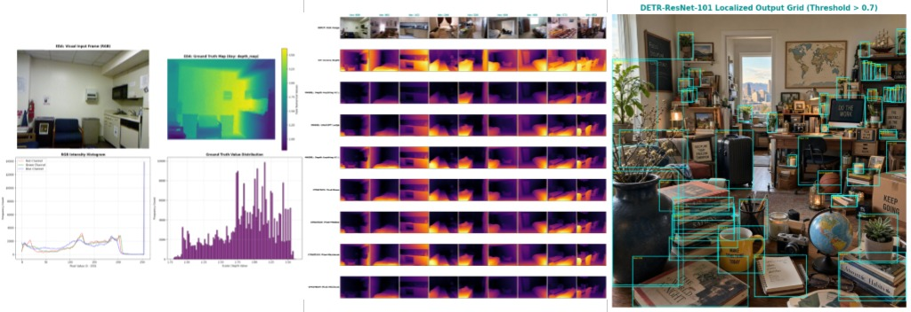

# Our OSF Preregistration Protocol

## Visual Synthesis
A comprehensive dashboard merging analytical insights from the research.

## 1. Study Information

### 1.1. Project Title & Authors
* **Title:** Depth Estimation
* **Author:** Dimo Dimov
* **Affiliation:** Deep Learning 2026 Course, SoftUni

### 1.2. Project Summary & Core Idea
* We want to figure out how far away objects are in a photo without training any deep-learning models from scratch. 
* We take three of the best modern out-of-the-box models (`Depth Anything V1`, `Depth Anything V2`, and `Intel DPT`) and let each make its own prediction.
* Then, we blend their outputs using four simple pixel-level fusion strategies: mean, median, maximum, and minimum.
* To find out which approach is the most reliable, we measure their accuracy against real-world ground-truth values from the **NYU Depth V2 validation dataset (654 indoor images)**.
* Finally, we pass the images through an object detector (`DETR`), a double-verification filter, and a smart vision-language model (`CLIP`) to profile scene difficulty and catch potential failures before they happen.

### 1.3. Research Questions & Hypotheses (What We Expect to Find)
* RQ1: Does combining the predictions of three standalone transformer models into a single ensemble give us a more reliable depth map than relying on just one network?
* Hypothesis 1 (Core): We expect the **Pixel-Median Strategy** (`Strategy_Pixel-Median`) to perform best overall. It should filter out weird noise, extreme shadows, and specular glare much better than individual models, scoring the lowest Root Mean Squared Error (RMSE) across the 654 test images.
* RQ2: Can zero-shot text-prompt analysis via CLIP successfully warn us when a room layout is too complex for standard computer vision models?
* Hypothesis 2: We expect CLIP to flag visual challenges, showing a strong link between high scene difficulty and increased pixel-level prediction errors.

---

## 2. Design Plan

### 2.1. Study Type
* This is a computational benchmarking simulation study.

### 2.2. Blinding & Randomization
* Since our models are already pre-trained and our code runs deterministically, traditional clinical blinding doesn't apply here. 
* To ensure total objectivity when building our 9×9 visual comparison grid, we calculate 9 mathematically evenly spaced image indexes across the 654-frame spectrum rather than hand-picking the "best-looking" results.

---

## 3. Sampling Plan (What We Are Testing)

### 3.1. Data Sources
* Our target benchmark source is the official **NYU Depth V2 Dataset Validation Split**, streamed directly from the cloud through Hugging Face (`vikhyatk/nyu_depth_v2`).

### 3.2. Sample Size Configuration
* All **654 synchronized image pairs** (RGB camera inputs + dense ground-truth depth maps).
* The first 5 consecutive indoor frames are streamed first for raw descriptive statistics and to double-check that our data schema loads properly.

### 3.3. Data Exclusion Criteria
* If an isolated object patch cropped by our detector results in a "degenerate box" (meaning its predicted bounding coordinates have a width or height of zero pixels), the pipeline automatically skips it to prevent runtime crashes.

---

## 4. Variables & Settings

### 4.1. What We Manipulate (Independent Variables)
* We evaluate 3 distinct core architectures (`Depth Anything V1 L`, `Depth Anything V2 L`, and `Intel DPT Large`).
* We try 4 different mathematical ways to merge them (`Mean`, `Median`, `Maximum`, `Minimum`).

### 4.2. What We Measure (Dependent Variables)
* We compute standard mathematical error metrics (**MSE**, **MAE**, and **RMSE**) against the ground truth.
* We use OpenCV filters (Laplacian Variance, Sobel Magnitude, and Brenner Gradient) to check if the models preserve crisp object boundaries and fine details.
* CLIP scores the object patches against 8 multi-modal risk profiles (like whether a patch is cluttered, dark, or textureless).

### 4.3. Our Safety Verification Gates (Threshold Constants)
To separate genuine objects from "ghost" artifacts and background noise, we lock in these specific filtering thresholds:
* `DETR` must be at least **70% confident** to detect an object initially.
* The cascade verification check requires at least a **50% confidence match** for the isolated patch to survive.
* The final re-detection tolerance gate is dialed down to **30%** for a final identity pass.

---

## 5. Statistical Analysis Plan

### 5.1. Calculations
All depth predictions are min-max normalized into continuous 0.0–1.0 float matrices (where brighter means closer to the camera). The code iterates through every single pixel to calculate the exact difference between our ensemble predictions and the real inverse ground-truth maps.

### 5.2. Hardware
Running three large vision transformers simultaneously takes a massive toll on hardware. To keep our environment running efficiently, we explicitly flush the GPU allocation tables using `torch.cuda.empty_cache()` and clear memory buffers after processing milestones to prevent runtime lag.

### 5.3. System
* The project is highly optimized for an **NVIDIA T4 GPU** runtime environment (such as Google Colab).
* The entire stack is built with Python, PyTorch, Hugging Face Transformers, OpenCV, and Gradio for the final interactive web application.

---
*Created as part of the SoftUni Deep Learning Course (July 2026).*